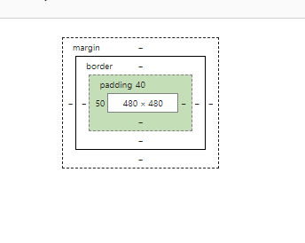

# Bugless-CSS

## Box

### Box Model 

html에서 만든 요소들은 브라우저에서 모두 '**박스**'로 표현된다. 박스는 일정한 형태의 모델로 구성되어 있기 때문에 아래와 같은 박스를 '**박스모델**'이라고 표현한다. 


#### content

content는 말 그대로 컨텐트가 들어있는 박스다. **width**와 **height**으로 이루어져 있다. 

#### padding

안쪽 여백. 즉, 컨텐트와 테두리 사이에 있는 공간이 바로 **padding**. 

#### border

테두리. 아래의 코드와 같이 **굵기, 스타일, 색상**에 대한 속성 모두를 부여해주어야 함. 

```css
border: 3px solid #000; 

/* border가 없다고 하고 싶을 때 */
border: none;

/* border를 둥글게 하고 싶을 때 */
border-radius: 4px;

/* 박스 자체를 원형으로 만들고 싶을때 */
border-radius: 50%

/* border를 개별적으로 깎고 싶을때 */
border-top-right-radius: 4px;
border-bottom-left-radius: 5px;
```

#### margin

바깥 여백. 즉, **요소와 요소 사이의 간격**을 나타내고 싶을 때 사용. 

#### shorthand 빠르게 쓰는 법

**시계 방향**을 기억해라! **top right bottom left** 순으로 한 번에 적으면 된다. 또한, **bottom은 top**과, **left는 right**과 짝이라는 것을 기억하자. 

```css
/* top 10px right 20px bottom 30px left 40px */
margin: 10px 20px 30px 40px; 

/* top과 bottom이 30px, right과 left가 20px */
margin: 30px 20px;

/* top이 10px, right과 left가 20px, bottom이 30px */
margin: 10px 20px 30px;
```

### Box Sizing

아래와 같이 padding-top이 40px, padding-left가 50px이고, width와 height가 모두 480px인 정사각형의 박스를 만든다고 하자. 


위와 같은 박스를 만들기 위해 아래와 같은 css 코드를 작성하게 될 것이다. 

```css
/* 이름이 box인 class */
.box{
    width: 480px;
    height: 480px;
    padding-top: 40px;
    padding-left: 50px;
    background-color: #0066ff;
    /* text 색상은 color로 지정할 수 있다 */
    color: #fff;
}
```

그런데 위와 같이 코드를 작성하게 되면, padding 값이 포함되어 width와 height가 520, 530인 직사각형 박스가 완성된다. 



왜 직사각형이 만들어졌을까? 바로 **Box-sizing이 content-box**로 설정되어 있기 때문이다. 즉, width와 height가 content-box를 기준으로 정해졌기 때문인 것이다.   
이를 border를 포함한 width와 height에 대한 설정으로 바꿔주기 위해서는 **box-sizing을 border-box**로 변경해주면 된다.


코드를 다음과 같이 변경하면, content-box에 변화가 생긴다. 

```css
/* 이름이 box인 class */
.box{
    box-sizing:border-box;
    width: 480px;
    height: 480px;
    padding-top: 40px;
    padding-left: 50px;
    background-color: #0066ff;
    /* text 색상은 color로 지정할 수 있다 */
    color: #fff;
}
```


대부분의 프론트엔드 개발자들은 위와 같은 상황때문에 처음부터 이를 깔고 시작한다고 한다. 

```css
/* *는 모든 요소에 해당됨을 의미*/
*{
    box-sizing: border-box;
}
```

### Box

박스모델보다 중요한 것은 바로  박스! **박스의 타입이 무엇이냐**에 따라서 박스 모델의 작동방식이 달라진다. 가장 중요하다고 여겨지는 박스 타입 4가지가 있다.  

* Block
* Inline
* Inline Block
* Flex

### Block

#### display

display는 box type을 결정 짓는 css 속성이다. display가 어떤 값이냐에 따라서 박스 값이 달라지는 것이다. 모든 html 요소는 다 display 값을 가지고 있다. 왜냐하면, 모든 html 요소는 박스로 표현되기 때문이다. 

#### block = 길막? 

브라우저가 html을 화면에 렌더할 때, 마크업이 된 순서대로 위에서 아래로 차곡차곡 쌓아나가는데, 쌓아올릴 요소가 **block** 박스라면 자기 다음에 올 요소가 자신의 옆자리로 오지 못하도록 무조건 '**길막**' 한다는 뜻이다.  아래의 사진처럼 말이다. 첫 번째 블록 요소 옆에는 600px나 자리가 남아있지만 다음 요소는 그 옆으로 갈 수가 없다. 바로 블록이 길막하고 있기 때문에! 


#### block의 특

1. 따로 width를 선언하지 않은 경우, **width = 부모의 content-box의 100%**를 차지
2. 따로 width를 선언한 경우, **남은 공간은 margin**으로 자동으로 채움. 그렇지만 개발자 도구로 확인해보면 그 margin이 표시되어 있지 않아, 나중에 디버깅할 때 난감한 경우가 있다. 그러므로 남은 공간을 margin으로 채운다는 것을 알아두는 게 매우 중요하다!  
3. width, height, padding, border, margin, 모든 박스의 속성이 자유롭게 사용 가능하다. 
4. 따로 부모의 height를 선언하지 않을 경우, 자식 요소의 height의 합 = 부모의 height가 된다. 

#### margin: 0 auto; 

css를 배운 적이 있다면, margin: 0 auto; 에 대해 들어본 적이 있을 것이다. 나 역시 들어본 적이 있지만, block의 특징을 안다면 저걸 굳이 외울 필요가 있나 싶다. 특정 block의 width: 400px로 설정했다고 하자\(부모의 width은 1000px일때\). **남은 600px은 margin이 자동으로 채울 것**이다. 다음과 같은 상황에서 margin-left: auto; 라고 하면 margin이 모두 왼쪽으로 채워지고, block은 오른쪽으로 이동할 것이다. 그리고, margin-right: auto; 라고 추가하면 블록이 중앙으로 이동할 것이다. 다음과 같은 원리에 의해서 marign: 0 auto; 라는 표현이 나온 것이다.  

### Inline


