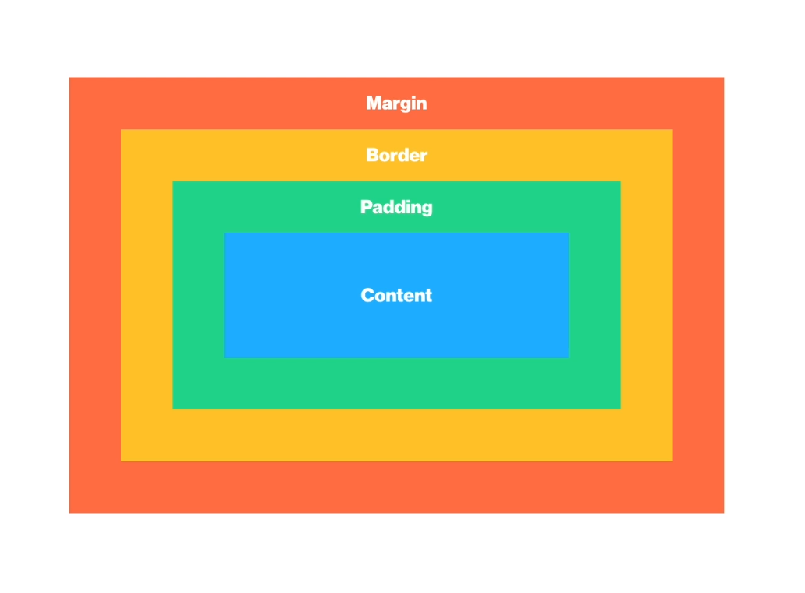

# Bugless-CSS

## Box

### Box Model 

html에서 만든 요소들은 브라우저에서 모두 '**박스**'로 표현된다. 박스는 일정한 형태의 모델로 구성되어 있기 때문에 아래와 같은 박스를 '**박스모델**'이라고 표현한다. 



#### content

content는 말 그대로 컨텐트가 들어있는 박스다. **width**와 **height**으로 이루어져 있다. 

#### padding

안쪽 여백. 즉, 컨텐트와 테두리 사이에 있는 공간이 바로 **padding**. 

#### border

테두리. 아래의 코드와 같이 **굵기, 스타일, 색상**에 대한 속성 모두를 부여해주어야 함. 

```css
border: 3px solid #000; 

/* border가 없다고 하고 싶을 때 */
border: none;

/* border를 둥글게 하고 싶을 때 */
border-radius: 4px;

/* 박스 자체를 원형으로 만들고 싶을때 */
border-radius: 50%

/* border를 개별적으로 깎고 싶을때 */
border-top-right-radius: 4px;
border-bottom-left-radius: 5px;
```

#### margin

바깥 여백. 즉, **요소와 요소 사이의 간격**을 나타내고 싶을 때 사용. 

#### shorthand 빠르게 쓰는 법

**시계 방향**을 기억해라! **top right bottom left** 순으로 한 번에 적으면 된다. 또한, **bottom은 top**과, **left는 right**과 짝이라는 것을 기억하자. 

```css
/* top 10px right 20px bottom 30px left 40px */
margin: 10px 20px 30px 40px; 

/* top과 bottom이 30px, right과 left가 20px */
margin: 30px 20px;

/* top이 10px, right과 left가 20px, bottom이 30px */
margin: 10px 20px 30px;
```

### 


