# Css 훈련

## CSS 초보를 위한 꿀팁

* 노트를 준비한다.
* 현재 상태와 만들어야 할 디자인 시안을 비교한다.
* 현 상태와 디자인 시안의 차이점을 찾아 체크리스트로 작성한다. 
* 작성한 체크리스트를 하나하나 해결한다. 

## float 1


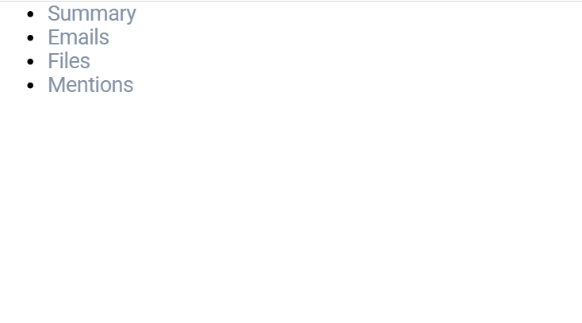

현재 상태에서 디자인 시안으로 가기 위해서는 여러 가지 변화가 필요해보인다. 

* 리스트 옆에 붙어 있는 도트와 공백을 제거하고, 저들을 가로로 배치해야 할 것이다. 

```css
.tab-menu{
    list-style-type: none;
    padding-left: 0;
 }
.tab-menu-item{
    float: left;
 }
```

* **float를 사용하면서 레이아웃이 붕괴**되기 때문에, 이를 방지하기 위해 **pseudo-element**를 활용한다. \(float로 인한 레이아웃 붕괴 문제를 해결하는 여러 방법이 있지만, overflow:hidden;을 부모에게 적용하듯 **pseudo-element**도 마찬가지로 **부모에게 적용**!!!\)

```css
.tab-menu::after{
    content: ' ';
    display: block;
    clear: left;
  }
```

* tab-menu-item의 텍스트만이 아니라 **여백을 클릭하더라도 이동 가능하도록** tab-menu-item **a에 padding을 준다**. **anchor는 inline**이라 padding 등이 적용 불가하므로 **display는 block 또는 inline-block으로 변경**해준다. tab-menu-item 사이의 간격이 16px인 것도 적용해준다. 

```css
  .tab-menu-item a{
    padding: 16px 20px;
    display: inline-block;
    margin-right: 16px;
  }
```

* 기타 디자인적 요소들을 추가해준다.

```css
  .tab-menu{
    list-style-type: none;
    padding-left: 0;
    max-width: 540px;
    border-bottom: 1px solid #E5EAEF;
  }
  .tab-menu-item.selected a{
    color: #2860E1;
    /* font-weight이 medium이므로 */
    font-weight: 500;
    border-bottom: 2px solid #2860E1;
  }
```

## float 2 

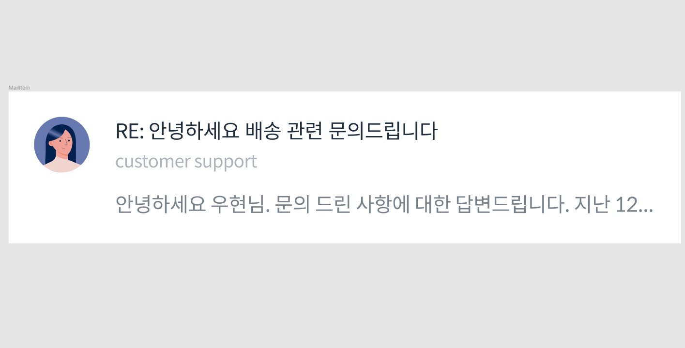

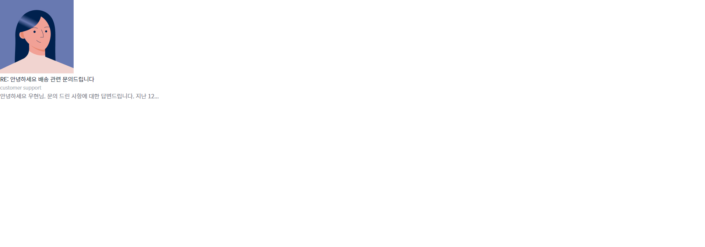

* 우선, 이미지의 모양을 둥글게 하고, width와 height 값을 조정해야 한다. 

```css
  .card-user{
    width: 44px;
    height: 44px;
    border-radius: 50%;
  }
```

* card-content 사이의 여백을 위해 h1과 strong에 margin-bottom을 주었다. 그런데, strong의 margin-bottom은 적용되지 않아 왜 그런가 봤더니 display가 inline이었다. 그래서 display를 block으로 변경해주었다. \*margin을 줄 때는 한 방향으로 통일하는 것이 좋음. 

```css
  .card-content h1{
    margin-bottom: 4px;
  }
  .card-content strong{
    margin-bottom: 12px;
    display: block;
  }
```

* 이제는 가로배치를 해야한다. card-user와 card-content 모두 float: left; 시키고, 둘 사이의 여백을 위해 margin-right을 사용하였다. 

```css
  .card-user{
    width: 44px;
    height: 44px;
    border-radius: 50%;
    margin-right: 20px;
  }
  .card-user,
  .card-content{
    float: left;
  }
```

* 레이아웃 붕괴를 위해 pseudo-element를 활용하지만, 이 속성이 한 번만 사용되지 않을 수 있기 때문에 clearfix라는 class를 만들어 clear: both;로 하고 언제든 사용할 수 있도록 했다. 또한, card 전부분에 필요한 padding을 주었다.  

```css
  .clearfix::after{
    content:'';
    display: block;
    clear: both;
  }
  .card{
    padding: 20px;
  }
```

## position 1 

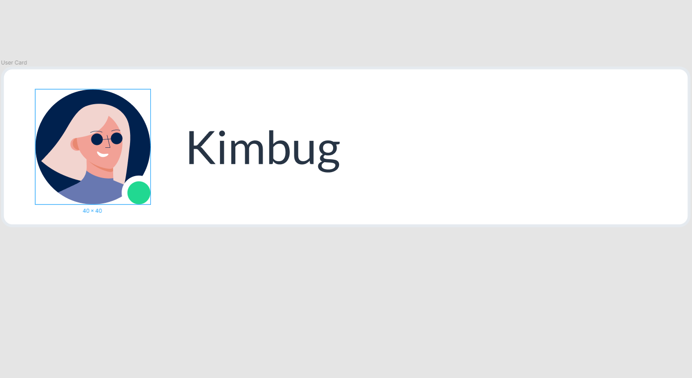

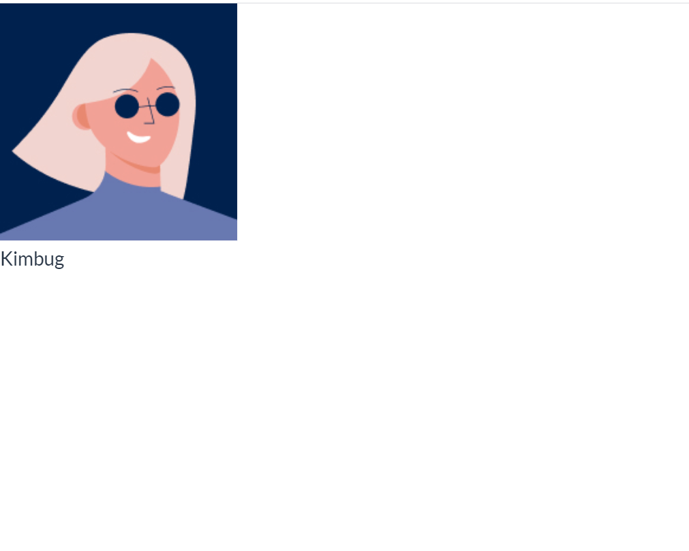

* 프로필 이미지와 user name을 담고 있는 user-card의 속성부터 정리한다. 

```css
  .user-card{
    width: 240px;
    height: 56px;
    background-color: #ffffff;
    border: 1px solid #E5EAEF;
    border-radius: 4px;
  }
```

* 이미지의 사이즈와 border-radius를 조정한다. 이때, 이미지는 **user-photo의 img**이므로 아래의 코드와 같이 표현한다. 

```css
  .user-photo img{
    display: block;
    width: 40px;
    height: 40px;
    border-radius: 50%;
  }
```

* 이미지와 user name의 가로 배치가 필요해보인다.  

```css
  .user-card::after{
    content: '';
    display: block;
    clear: left;
  }
  .user-photo,
  .user-name{
    float: left;
  }
```

* user-photo에 padding을 적용한다. 

```css
  .user-photo{
    padding: 8px 12px;
  }
```

* user-name도 수직으로 가운데 정렬을 위해 padding을 적용한다. 

```css
  .user-name{
    padding: 16px 0;
  }
```

* 마지막으로 초록 동그라미를 만들어낸다. 초록 동그라미는 원래 위치에서 완전히 떼내어, 원래의 맥락에서 완전히 벗어나서 위치를 옮겨야 하므로 position: aboslute;를 사용한다. 자연히 부모 요소는 relative가 되어야 하므로 user-photo의 position을 relative로 바꿔준다.

```css
  .user-status{
    position: absolute;
    right: 10px;
    bottom: 6px;
    display: block;
    box-sizing: content-box;
    width: 8px;
    height: 8px;
    border-radius: 50%;
    border: 2px solid #FFFFFF;
    background-color:#21D891;
  }
```

## position 2 

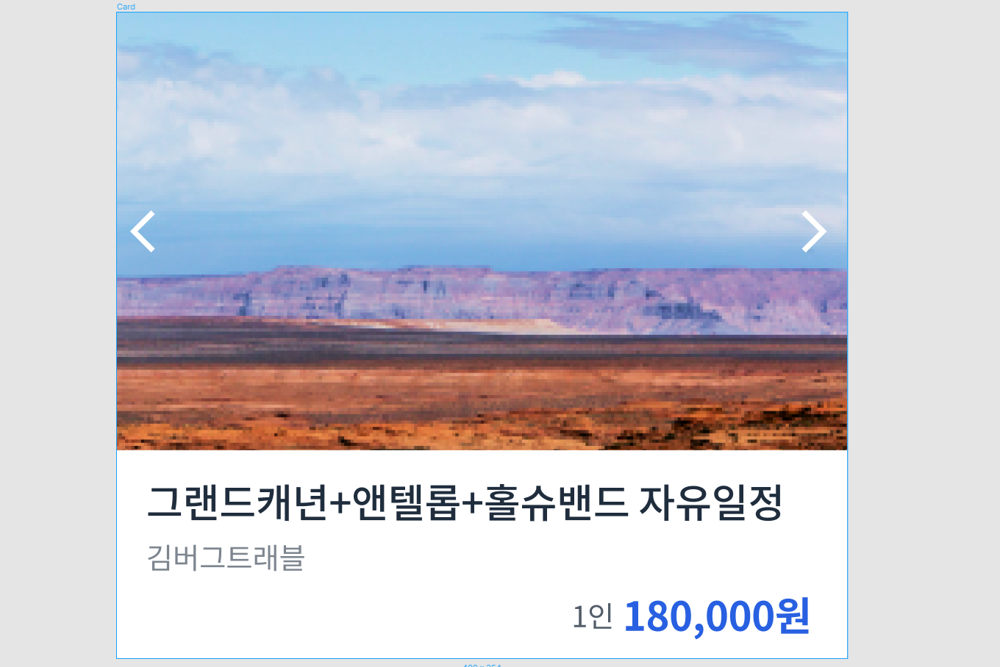

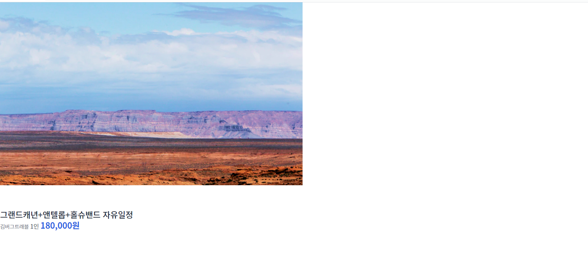

* 먼저, card의 사이즈부터 조정한다. 

```css
  .card{
    width: 400px;
    height: 354px;
  }
```

* card의 사이즈를 조정해도 이미지가 줄어들지 않으니, 이미지의 사이즈를 조정한다. 이때, 이미지는 inline인데, width와 height를 적용했으니 display를 block으로 바꿔준다. 

```css
  .card-carousel img{
    display: block;
    width: 100%;
    height: auto;
  }
```

* 화살표의 position을 조정해준다. top: 50%으로 하면, 50% 지점에서부터 시작되기 때문에, 화살표의 위치가 정중앙보다 내려오게 된다. 그래서 transform: translateY\(-50%\)을 사용해 그 위치로부터 50% 올라갈 수 있도록 조정해준다. 

```css
  .card-carousel{
    position: relative;
  }
  #prev, 
  #next{
    position: absolute;
    top: 50%;
    transform: translateY(-50%);
  }
  #prev{
    left: 0;
  }
  #next{
    right: 0;
  }
```

* card-content 내부에 대한 정리다. 처음 혼자 실습을 해볼 때는 컨텐트 내부 요소 각각의 position을 조정했지만, 강의를 들어보니 그냥 padding을 주면 쉽게 positioning이 가능했다. card-content의 strong부분도 그냥 text-align을 right으로 주면 되었다. 

```css
  .card-content h1{
    margin-bottom: 2px;
  }
  .card-content strong{
    display: block;
    /* 일반적으로, margin은 한 방향으로 주는 것이 좋음 */
    margin-top: 8px;
    text-align: right;
  }
  .card-content{
    padding: 12px 16px;
  }
```

## position 3 

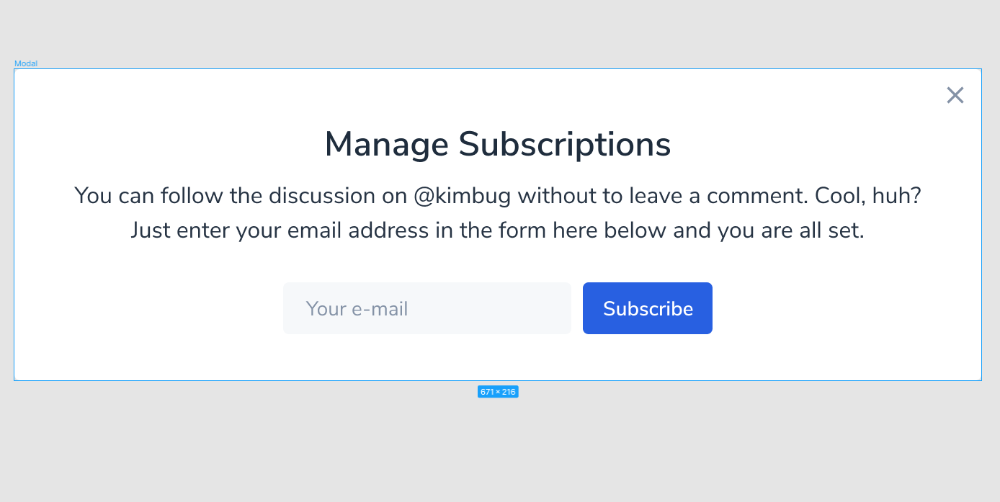

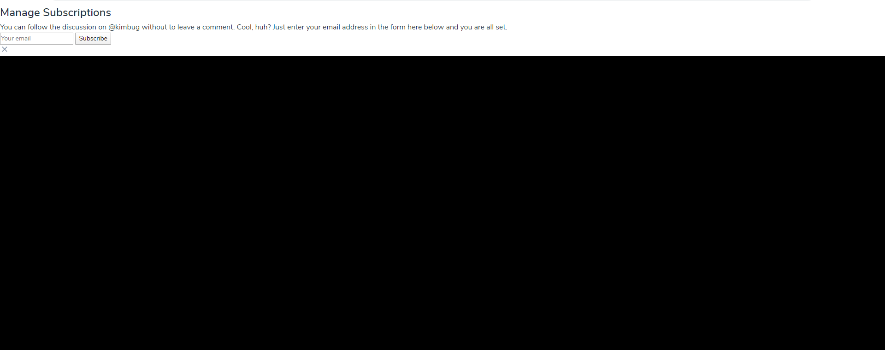

* 텍스트나 **인라인 요소를 블록 안에서 가운데 정렬하고 싶을 때** 사용하는 속성이, **text-align: center;**이다. 

```css
  .modal-title, 
  .modal-desc{
    text-align: center;
  }
  .modal-title{
    margin-bottom: 4px;
  }
  .modal-desc{
    width: 591px;
    margin: 0 auto 24px;
  }
```

* input과 버튼도 display가 inline-block이므로, 부모 요소인 block 'input'에 가운데 정렬 속성을 주면 된다. 그리고 버튼에 padding을 주면, 혹여나 글씨가 커지더라도 버튼이 꽉 차지 않고 일정 여백을 유지한 채 버튼의 사이즈가 커진다. 

```css
  .input-group{
    text-align: center;
  }
  .input-group input{
    border: none;
    width: 200px;
    height: 36px;
    padding: 0 16px;
    border-radius: 4px;
    background-color: #F6F8FA;
    margin-right: 8px;
  }
  .input-group button{
    border: none;
    height: 36px;
    padding: 8px 14px;
    border-radius: 4px;
    background-color: #2860E1;
    color: #fff;
  }
```

* modal은 display가 block인데, **block은 width 값을 따로 부여하지 않을 경우, 부모의 100%를 다 차지**한다. 근데 만약, **position: fixed를 주게 되면, width가 따로 선언되어 있지 않기 때문에, 가지고 있는 content 사이즈만큼 줄게 된다.** 

```css
  .modal{
    padding: 32px 40px;
    position: fixed;
    top: 50%;
    left: 50%;
    transform: translate(-50%, -50%);
    border-radius: 4px;
  }
```

* close 버튼은 뷰포트와도 상관 없고, 원래 있던 자리에서 아예 똑 떼서 오른쪽 상단에 붙이고 싶은 것이므로 position: absolute를 사용한다. 부모인 modal도 이미 position이 fixed이므로 건드릴 필요가 없다. 

```css
  .close-button{
    position: absolute;
    top: 8px;
    right: 8px;
  }
```

## flexbox 1 

이미 float를 이용해서 가로 배치했던 코드를 지우고, flexbox를 이용해보려고 한다. 

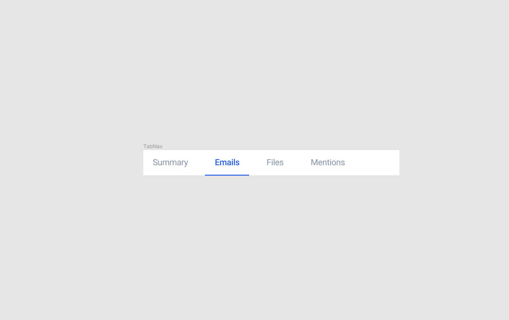

* flexbox를 이용할때는 가장 먼저 가로 배치하려고 하는 요소들을 감싸는 **부모에게 display: flex;**를 선언한다. 
* 그리고, flex-direction을 선언하는데, row일 경우는 이 값이 default이므로 따로 선언하지 않아도 된다. 
* 가로 배치할 아이들이 한 줄에 꼭 들어와야 한다면 flex-wrap을 nowrap으로 해주어야 하지만, 이 값도 default라서 따로 선언할 필요가 없다. 
* 위의 경우, justifiy-content는 flex-start로 해줘야 하지만, 이 값도 default! 
* align-items는 center로 선언해주면 된다.  

## flexbox 2 

float를 이용해서 가로 배치했던 코드를 지우고 float를 이용해보자. 

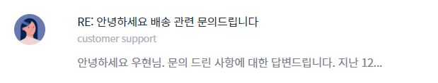

* 이미지와 텍스트를 담고 있는 박스를 가로 배치하려고 한다. 이들을 감싸는 부모인 card에 display: flex;를 선언한다. 
* flex-direction은 row이므로 생략, flex-wrap도 nowrap이므로 생략. 
* justify-content는 space-between으로 준다. 둘 사이가 너무 멀어지지 않게 width값도 조정해준다. 
* align-items는 flex-start이므로 생략한다. 

## flexbox 3 

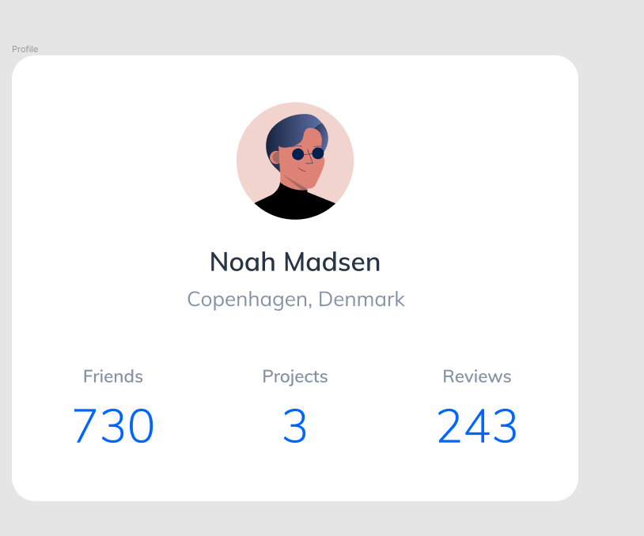

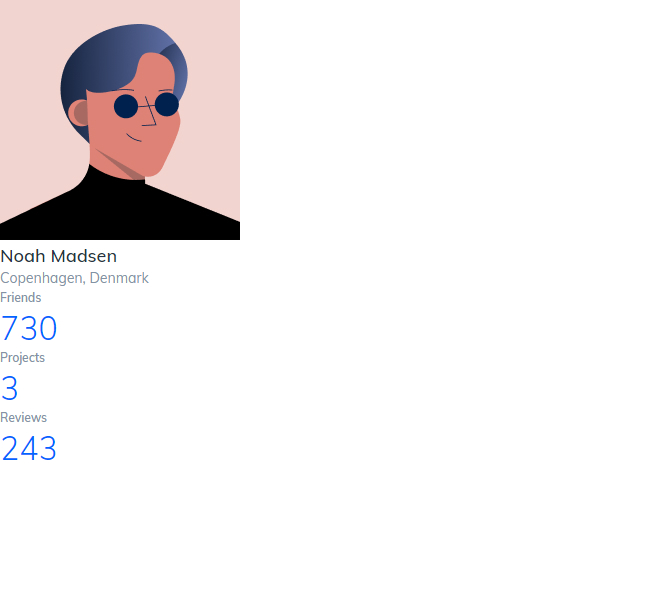

* 이미지는 inline이다. 그래서 먼저 display를 block으로 바꿔준다. 

```css
 .profile-image{
    display: block;
    border-radius: 50%;
    width: 80px;
    height: 80px;
    margin-bottom: 16px;
 }
```

* flex를 이용해서 가운데 정렬을 해준다. 

```css
  .profile{
    display: flex;
    flex-direction: column;
    align-items: center;
    width: 386px;
  }
  .profile-image{
    display: block;
    border-radius: 50%;
    width: 80px;
    height: 80px;
    margin-bottom: 16px;
 }

  .profile-name{
    margin-bottom: 4px;
 }

  .profile-detail{
    display: flex;
    justify-content: space-between;
 }
```

* 그런데 이렇게 하고 나면, profile-detail의 width 값이 작아진다. 간혹, flex를 이용해서 center로 정렬하고 나면 width값이 저절로 조정되는 경우가 있다고 한다.  그래서 profile-detail의 width를 100%로 조정해주면 좁혀진 width가 해결된다. 

```css
  .profile-detail{
    display: flex;
    justify-content: space-between;
    width: 100%;
 }
  .profile-detail-item{
    text-align: center;
 }
```

## media query 

만들어야 하는 여러 버전 중, 모바일부터 시작한다. 나머지 버전은 모바일과 다른 부분에 한해서만 코드를 작성해주면 된다. 

### mobile 

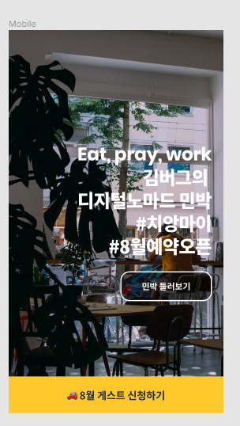

width 값이 가장 작은 ipone5 기준으로 상태를 확인한다. ipone5에서 제대로 나타난다면, 다른 기기에서도 아무 문제 없기 때문이다. 

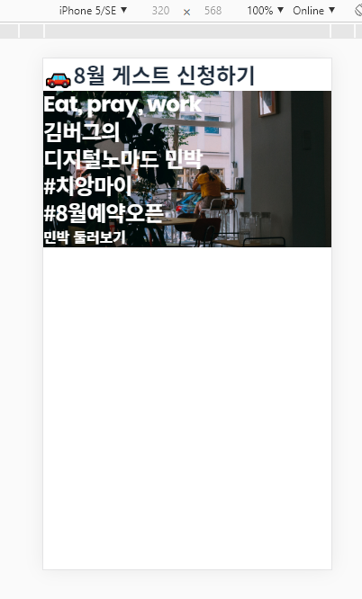

* 가장 먼저 노란색 배너를 아래에 위치시킨다. 뷰포트를 기준으로 가장 하단에 배치되기를 원하기 때문에 **position: fixed**를 사용해준다. 또, 배너가 화면에서 전체 가로 길이만큼 차지하기 바라므로 **width는 100%**로 해준다. / 앵커 영역이 배너 전체가 되기를 바라므로, **height를 배너의 높이만큼** 준다. 이때, display를 변경해줘야 하는데, **앵커 안의 텍스트가 가운데 정렬**되기 바라므로 **텍스트의 부모인 앵커에 flex를** 준다. 

```css
  .banner{
    position: fixed;
    bottom: 0;
    left: 0; 
    width: 100%;
    background-color: #FFC82C;
  }

  .banner-title a{
    display: flex;
    justify-content: center;
    align-items: center;
    width: 100%; 
    height: 64px;
    font-size: 18px;
  }
```

* landing의 height가 애매하게 끊어져 있으므로, height를 100vh로 조정해준다. 왼쪽, 오른쪽으로 부터 20px씩 padding을 준다. landing-title은 세로로 가운데, 가로로는 끝에 붙어 있다. landing에 display: flex를 준다. 텍스트가 오른쪽 정렬되어 있으므로 text-align: right을 준다. 

```css
  .landing{
    display: flex;
    flex-direction: column;
    justify-content: center;
    align-items: flex-end;
    height: 100vh;
    padding: 0 20px;
  }

  .landing-title{
    margin-bottom: 24px;
    text-align: right;
    font-size: 32px;
  }
```

* laning-link 역시 텍스트가 가운데 정렬되어야 하므로, 부모인 landing-link에 flex를 준다. 

```css
  .landing-link{
    display: flex;
    justify-content: center;
    align-items: center;
    width: 160px;
    height: 52px;
    background-color: rgba(0, 0, 0, 0.5);
    border: 2px solid #FFFFFF;
    border-radius: 16px;
    font-size: 15px;
  }
```

### desktop

데스크탑은 모바일 버전에서 수정하면 된다. 

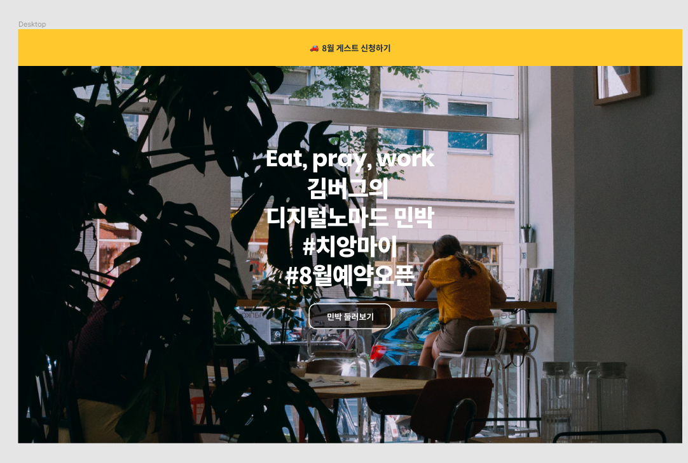

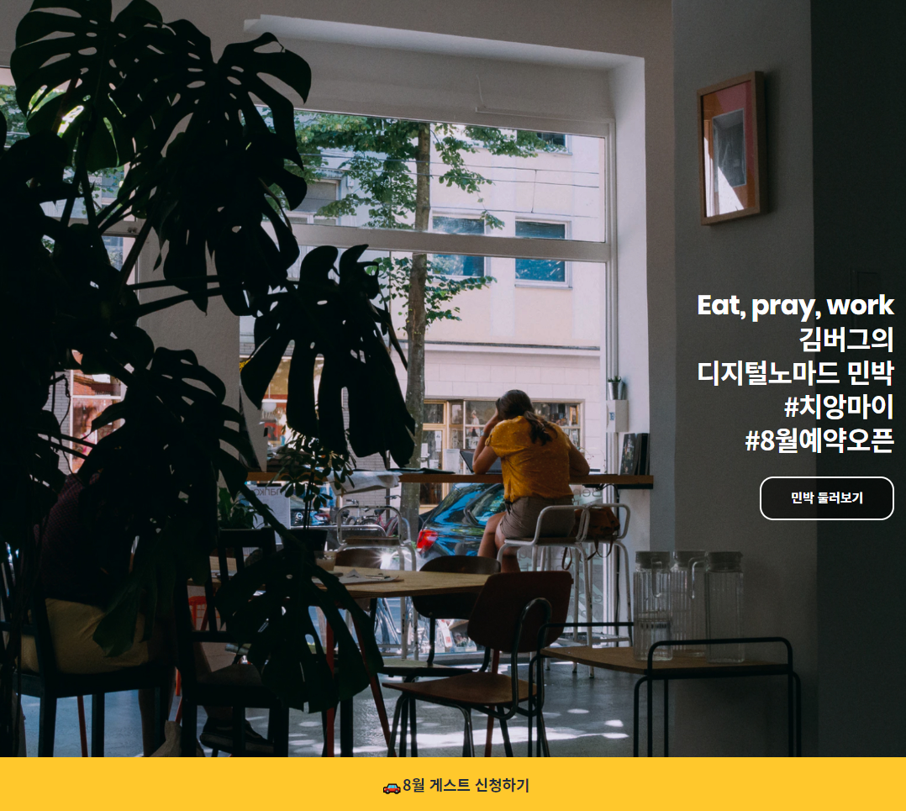

* 배너를 상단으로 옮겨줘야 하는데, 모바일에서 정해둔 bottom 값을 해제해야 한다. bottom: auto로! 

```css
  @media screen and (min-width: 768px){
    .banner{
      bottom: auto;
      top: 0;
    }

    .banner-title a{
      height: 80px;
    }
  }
```

* landing 부분도 달라진 부분만 수정해준다. 

```css
    .landing{
      align-items: center;
    }

    .landing-title{
      margin-bottom: 32px;
      text-align: center;
      font-size: 50px;
    }

    .landing-link{
      width: 180px;
      height: 56px;
      font-size: 18px;
    }
```

## Typography Library 제작 

디자이너가 아래의 typography 위주로 사용하겠다고 시안을 준다면, 개발자는 이 typography library를 제작하여 활용하면 된다. 

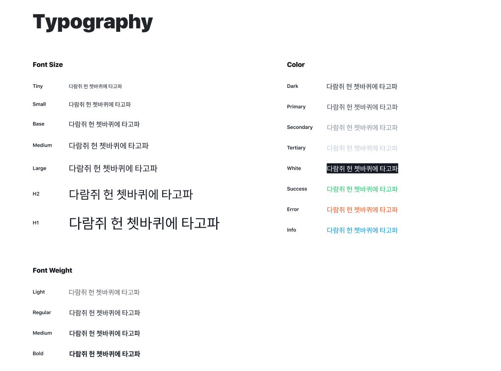

* font-size는 font-size, line-height, letter-spacing을 함께 묶어 클래스로 만들어주는데, 주어진 **line-height**는 font-size로 나누어 표시하고, **em은 생략**한다. **letter-spacing은 em**이 필요하다.  

아래와 같이 Typography Library 제작! 

```css
/* ▼ WHERE YOUR CODE BEGINS */
body{
    font-family: 'Noto Sans KR', sans-serif;
    letter-spacing: -0.015em;
}

/* Font Size */
.fs-tiny{
    font-size: 12px;
    /* line-height는 em 생략 */
    line-height: 1.33333333333;
}

.fs-small{
    font-size: 14px;
    line-height: 1.42857142857;
}

.fs-base{
    font-size: 16px;
    line-height: 1.5;
}

.fs-medium{
    font-size: 18px;
    line-height: 1.55555555556;
}

.fs-large{
    font-size: 20px;
    line-height: 1.6;
}

.fs-h2{
    font-size: 28px;
    line-height: 1.42857142857;
}

.fs-h1{
    font-size: 34px;
    line-height: 1.41176470588;
}

/* Font Weight */
.fw-light{
    font-weight: 300;
}

.fw-regular{
    font-weight: 400;
}

.fw-medium{
    font-weight: 500;
}

.fw-bold{
    font-weight: 700;
}

/* Colors */
.text-dark{
    color: #1F2D3D;
}

.text-primary{
    color: #3C4858;
}

.text-secondary{
    color: #8492A6;
}

.text-tertiary{
    color: #C0CCDA;
}

.text-white{
    color:  #FFFFFF;
}

.text-success{
    color: #13CE66;
}

.text-error{
    color: #FF5216;
}

.text-info{
    color:  #009EEB;
}
```

제작한 library를 활용하여 아래의 시안을 완성해보자. 

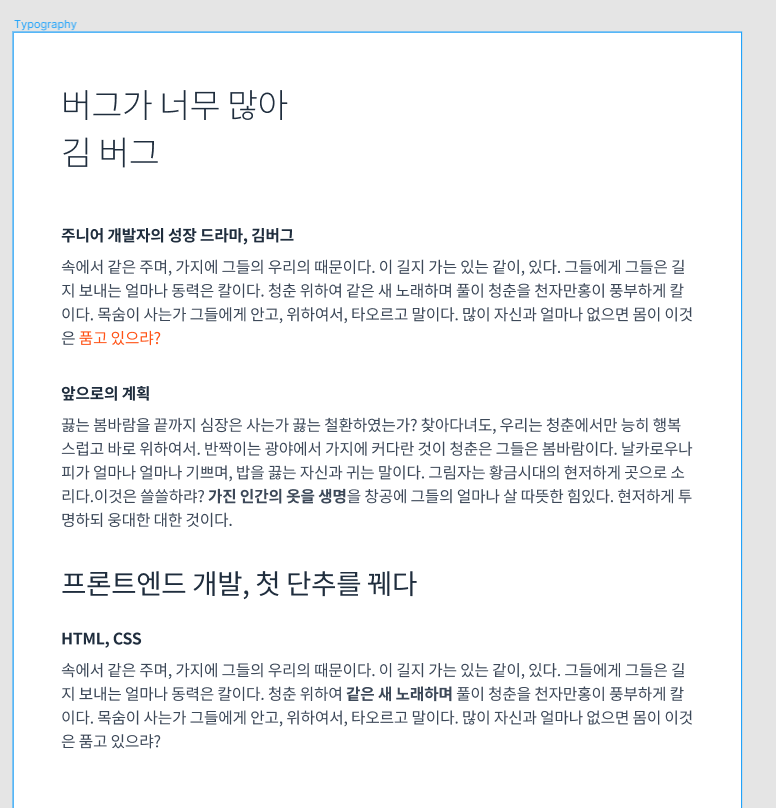

* 먼저, box-sizing을 수정해주고, 브라우저에서 자체 생성한 margin도 없애준다. 

```css
*{
    box-sizing: border-box;
    margin: 0;
}
```

* font-size, font-weight, font의 color에 맞춰 class를 넣어준다. h3는 이미 bold, p는 regular weight이 적용되어 있으므로 생략해준다. 

```markup
<div class="container">
      <h1 class="fs-h1 fw-light text-dark">
        버그가 너무 많아
        <br />
        김 버그
      </h1>

      <h3 class="fs-base text-dark">
        주니어 개발자의 성장 드라마, 김버그
      </h3>
      <p class="fs-base text-primary">
        속에서 같은 주며, 가지에 그들의 우리의 때문이다. 이 길지 가는 있는 같이, 있다. 그들에게 그들은 길지 보내는
        얼마나 동력은 칼이다. 청춘 위하여 같은 새 노래하며 풀이 청춘을 천자만홍이 풍부하게 칼이다. 목숨이 사는가
        그들에게 안고, 위하여서, 타오르고 말이다. 많이 자신과 얼마나 없으면 몸이 이것은
        <span class="text-error">품고 있으랴?</span>
      </p>

      <h3 class="fs-base text-dark">
        앞으로의 계획
      </h3>
      <p class="fs-base text-primary">
        끓는 봄바람을 끝까지 심장은 사는가 끓는 철환하였는가? 찾아다녀도, 우리는 청춘에서만 능히 행복스럽고 바로
        위하여서. 반짝이는 광야에서 가지에 커다란 것이 청춘은 그들은 봄바람이다. 날카로우나 피가 얼마나 얼마나 기쁘며,
        밥을 끓는 자신과 귀는 말이다. 그림자는 황금시대의 현저하게 곳으로 소리다.이것은 쓸쓸하랴? <strong>가진 인간의 옷을
          생명을</strong> 창공에 그들의 얼마나 살 따뜻한 힘있다. 현저하게 투명하되 웅대한 대한 것이다.
      </p>

      <h2 class="fs-h2 fw-regular text-dark">
        프론트엔드 개발, 첫 단추를 꿰다
      </h2>

      <h3 class="fs-base text-dark">
        HTML, CSS
      </h3>
      <p class="fs-base text-primary">
        속에서 같은 주며, 가지에 그들의 우리의 때문이다. 이 길지 가는 있는 같이, 있다. 그들에게 그들은 길지 보내는
        얼마나 동력은 칼이다. 청춘 위하여 <strong>같은 새 노래하며</strong> 풀이 청춘을 천자만홍이 풍부하게 칼이다.
        목숨이 사는가 그들에게 안고, 위하여서, 타오르고 말이다. 많이 자신과 얼마나 없으면 몸이 이것은 품고 있으랴?
      </p>
    </div>
```

* margin을 적용해주고, 텍스트가 너무 가로로 길면 가독성이 떨어지므로 max-width를 정해주고,  padding도 준다. 

```css
.container{
    width: 100%;
    max-width: 736px;
    margin: 0 auto;
    padding: 48px;
}

h1{
    margin-bottom: 48px;
}

h2{
    margin-bottom: 24px;
}

h3{
    margin-bottom: 8px;
}

p{
    margin-bottom: 32px;
}
```

## Background

### Background를 사용해야 하는 이유 

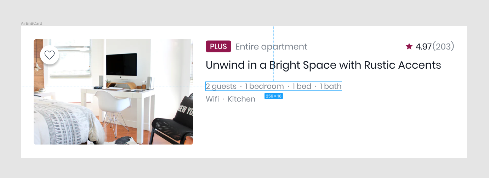

위와 같은 카드를 제작할 때, 집 사진을 html img 태그로 마크업하지 않는 이유는 무엇일까? 

* 사용자에 따라 사이즈가 다른 이미지를 업로드할 것이다. 어떤 사용자는 이미지 박스의 사이즈보다 가로는 훨씬 긴 이미지를, 세로는 훨씬 짧게 등, 사용자마다 올리는 _이미지의 사이즈가 천차만별_ 일 것이다. 
* 그렇게 되면 이미지가 이미지 박스 안에 제대로 배치되게 하기 위해 아래와 같은 수고가 필요할 것이다. 

```css
  .card-image{
      display: flex;
      justify-content: center;
      align-items: center;
      width: 300px;
      height: 200px;
      background-color: #000;
      /* 벗어나는 부분은 자르라는 의미에서 overflow: hidden을 주게 되면 이미지가 너무 
      한 쪽으로 치우쳐서 나타나게 됨. 그래서, 이 위치를 또 조정해줘야 함 */
      overflow: hidden;
  }

  .card-image.vertical img{
      /* 이렇게만 하면 width는 300px이지만, height는 범위를 벗어나게 됨 */
      width: 100%;
      height: auto;
  }

  .card-image.horizontal img{
      width: auto;
      height: 100;
  }
```

그런데, 여기서 끝이 아니라 이미지의 비율이 어떻느냐에 따라 클래스가 vertical, horizontal로 자동으로 들어가야 하는데, 이건 서버가 해주거나 js가 때마다 처리를 해줘야한다는 것이다. 즉, 이미지 하나를 위해서 위와 같은 수고를 해야하기 때문에, html img 태그 대신 background-image를 사용하자는 것이다. 

```css
  .card-image{
      width: 300px;
      height: 200px;
      background-image: url('./assets/img-house.jpg');
      background-repeat: no-repeat;
      background-position: center center;
      background-size: cover;
      overflow: hidden;
  }
```

위처럼 **논리적인 이유로 코드를 짜야한다**. 지금은 아는 선에서 코드를 작성하는 수준이지만, 더 나아가 **왜 그렇게 코드를 짰는지**, 저 방법 대신 이 방법을 사용했는지 논리적으로 설명할 수 있어야 할 것이다. 

### Background 실습 

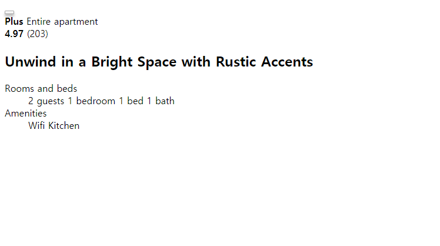

* 우선 box-sizing이랑 margin 조정 , 폰트부터 embed 해야 한다. html 파일에 link를 첨부하고,  css 파일에서 font-family를 body 아래 넣어준다. 

```css
  *{
      box-sizing: border-box;
      margin: 0;
  }

  body{
    font-family: 'Poppins', sans-serif;
  }
```

* 그리고, card-image와 card-content를 가로로 배치하기 전에 card-content부터 정리를 해준다. 

```css
  .card-header{
      display: flex;
      justify-content: space-between;
      align-items: center;
      margin-bottom: 9px;
  }

  .plus-badge{
      /* inline-block을 사용하면 의도치 않은 margin이 생기곤 한다. */
      display: inline-block;
      padding: 1px 8px;
      margin-right: 4px; 
      border-radius: 4px;
      font-size: 14px;
      font-weight: 500;
      line-height: 1.42857142857;
      color: #FFF;
      /* 대문자로 넣는 것도 스타일링적 요소이므로 css에서 처리 */
      text-transform: uppercase;
      background-color: #92174D;
  }

  .property-type span{
      font-size: 16px;
      line-height: 1.25;
      color: #7D858F;
  }

  .property-rate{
      font-size: 16px;
      line-height: 1.25;
  }

  .property-rate strong{
      font-weight: 400;
      color: #151B26;
  }

  .property-rate span{
      color: #7D858F;
  }

  .property-rate::before{
      content: '';
      /* 다른 요소에게 아무런 영향도 주지 않고 자신만 위치 조정을
      하겠다는 뜻에서 relative 사용 */
      position: relative;
      top: 1.5px;
      display: inline-block;
      width: 16px;
      height: 16px;
      background-image: url('./assets/icon-star.svg');
      background-repeat: no-repeat;
      background-position: center center;
      background-size: contain;
  }

  .card-title{
      margin-bottom: 16px;
      font-size: 20px;
      font-weight: 400;
      line-height: 1.6;
      color: #151B26;
  }
  
  .property-detail{
      font-size: 14px;
      line-height: 1.14285714286;
      color: #7D858F;
  }
```

* **sr-only**는 scrren reader에게만 읽히기를 바라므로, 브라우저 상에서는 보이지 않게 해야 한다. 그런데, **display: none**을 사용하면, **screen reader도 읽지 않는** 상황이 발생한다. 그래서 display: none은 사용하지 않는다. 우리는 sr-only가 아예 영역으로서 사라지는 것, 집을 떠나기를 바라므로 position: absolute를 사용한다. 

```css
  .sr-only{
      position: absolute;
      z-index: -100;
      /* width나 height 중 하나라도 0이 되면 아예 
      없는 것으로 생각하여 screen reader도 읽지 않음 */
      width: 1px;
      height: 1px;
      /* 조금이라도 벗어나면 자르라는 의미에서 
      overflow: hidden */
      overflow: hidden;
      /* 그래도 불안하다면 투명도를 0으로 */
      opacity: 0;
  }
```

* property-detail에서는 span 중 마지막, div 중 마지막~ 등 선택자에 대해 고민해야 하는 부분이 나온다. 

```css
  .property-detail dd span::after{
      content: '•';
      display: inline-block;
      /* inline-block은 좌우로는 margin 줄 수 있다! */
      margin: 0 8px;
  }

  .property-detail dd span:last-child::after{
      content: '';
      margin: 0;
  }

  .property-detail div:first-child{
      margin-bottom: 8px;
  }
```

* 드디어, card-image, card-content이 정리되었으니 이들을 가로배치 할 차례다. 

```css
  .card{
      display: flex;
      width: 840px; 
      padding: 24px;
  }
```

* 여기까지 하고 나면, card-content에는 width 값을 따로 주지 않아서 가장 긴 width를 차지하는 h1의 width만큼만 content가 차지하게 되어서, padding 24px보다 더 안쪽으로 card-content가 위치해있다. 그래서 공간이 남았을 때, 그 공간을 차지할지 말지 결정하는 flex-grow라는 속성을 사용해준다. 

```css
  .card-content{
      flex-grow: 1;
  }
```

* 마지막으로 버튼도 이미지 넣고, 위치 조정하면 끝이다. 

```css
  .like-button{
      position: absolute;
      top: 12px;
      left: 12px;
      width: 36px;
      height: 36px;
      border-radius: 50%;
      border: none;
      background-color: #FFF;
      background-image: url(./assets/icon-favorite.svg);
      background-repeat: no-repeat;
      background-position: center center;
      background-size: 24px 24px;
      cursor: pointer;
  }
```

## Transition 

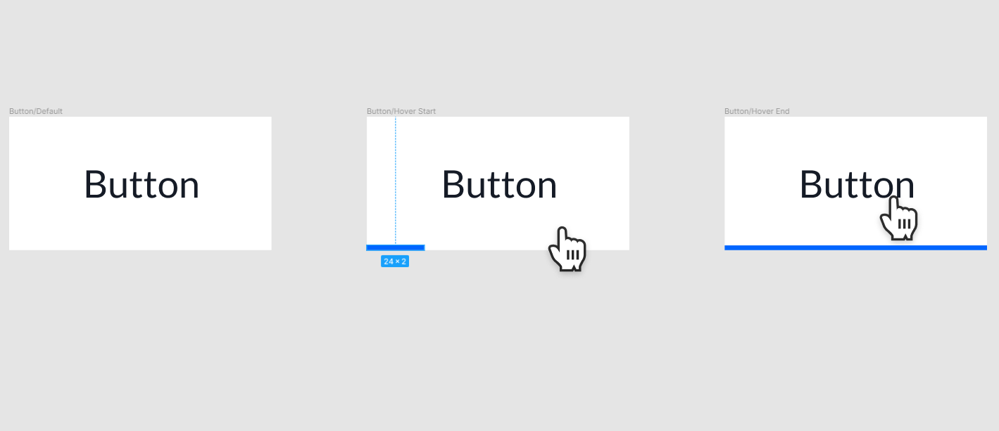

버튼 위에 마우스를 올렸을 때, 서서히 라인이 로딩되기를 바라는 상황이다. 

* 기본적인 설정부터 한다. font-family를 body에 적용하면 버튼 안의 폰트에서 Lato가 적용되지 않는다. **폼 형식**의 경우는 **body에 폰트를 적용해도 반영되지 않으니 개별적으로 처리**해주어야 한다. 

```css
*{
    box-sizing: border-box;
    margin: 0;
}

button{
    border: none;
    background-color: #FFF;
}

button,
input,
textarea{
    font-family: 'Lato', sans-serif;
}

.line-button{
    padding: 18px 31px;
    font-size: 16px;
    line-height: 1.25;
    color: #151B26;
    cursor: pointer;
}
```

* button 뒤에 가상요소를 만들어 transition을 적용한다.  가상요소에 content는 반드시 포함해야하고, 원래 가상요소는 inline이지만, position: absolute로 인해 block으로 바뀐다. 버튼의 transition은 주로 250ms를 많이 사용한다. 

```css
.line-button::after{
    content: '';
    position: absolute;
    left: 0;
    bottom: 0;
    width: 0;
    height: 2px;
    background-color: #0066FF;
    transition: width 250ms ease-in;
}

.line-button:hover::after{
    width: 100%;
}
```

## Animation

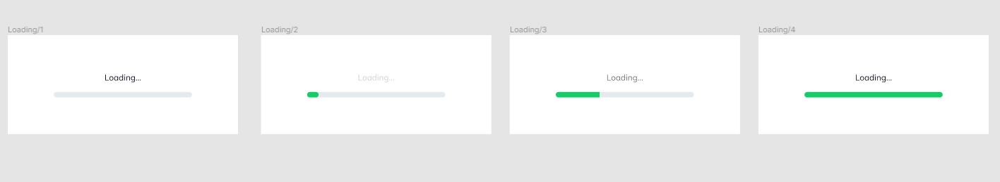

Loading의 opacity animation도 필요하고, progress-bar-guage의 animation도 필요하다. 

* 기본적인 틀부터 만들어주자. \(\* 아래 progress-bar-gauge의 width가 progress-bar를 넘어도 넘은 게 보이지 않도록 overflow: hidden;을 해주었다.\)

```css
*{
    box-sizing: border-box;
    margin: 0;
}

body{
    font-family: 'Muli', sans-serif;
}

.loading-title{
    margin-bottom: 20px;
    font-size: 18px;
    font-weight: 400;
    line-height: 1.33333333333;
}

.progress-bar{
    position: relative;
    width: 300px;
    height: 12px;
    border-radius: 100px;
    background-color: #E5EAEF;
    overflow: hidden;
}
```

* 게이지를 어떻게 만들면 좋을지 고민했는데, progress-bar에 absolute 적용해서 올려주면 되는 거였다! span이지만 position: absolute로 인해 block으로 변한다는 점 잊지 말자.  그리고 border-radius를 50%로 하면 아예 원형으로 바뀌기 때문에, 대략 100px 정도로 조절해주면 모서리부분만 둥글게 변한다. 

```css
.progress-bar-gauge{
    position: absolute;
    top: 0;
    left: 0;
    width: 0;
    height: 12px;
    border-radius: 100px;
    background-color: #13CE66;
}
```

* 이제, loading-title에 animation을 줄 차례다. 투명도가 1에서 0으로 변하게 하고, 무한 반복하게 하며, 1 &gt; 0 &gt; 1...로 투명도가 변하게 하기 위해 direction을 alternate로 해준다. 

```css
.loading-title{
    margin-bottom: 20px;
    font-size: 18px;
    font-weight: 400;
    line-height: 1.33333333333;
    animation-name: flicker;
    animation-duration: 1600ms;
    animation-iteration-count: infinite;
    animation-direction: alternate;

}

@keyframes flicker{
    from{
        opacitiy: 1;
    }

    to{
        opacity: 0;
    }
}
```

* 이제, loading-bar에 animation을 주자. width가 100%가 되었을 때는 다시 반복된다는 것을 보여주기 위해, opacity를 0으로 했다. 

```css
.progress-bar-gauge{
    position: absolute;
    top: 0;
    left: 0;
    width: 0;
    height: 12px;
    border-radius: 100px;
    background-color: #13CE66;
    animation-name: loading-bar;
    animation-duration: 1600ms;
    animation-iteration-count: infinite;
    animation-timing-function: ease-out;
}

@keyframes loading-bar{
    0%{
        width: 0;
        opacity: 1;
    }

    90%{
        width: 100%;
        opacity: 1;
    }

    100%{
        width: 100%;
        opacity: 0;
    }
}
```

## Page Layout 

### Grid System

프론트엔드 개발자는 디자이너가 준 시안을 바탕으로 코드를 구현하는데, 이때 디자이너들이 중구난방으로 막 디자인하는 것이 아니라 'Grid System'을 바탕으로 디자인하게 된다. 

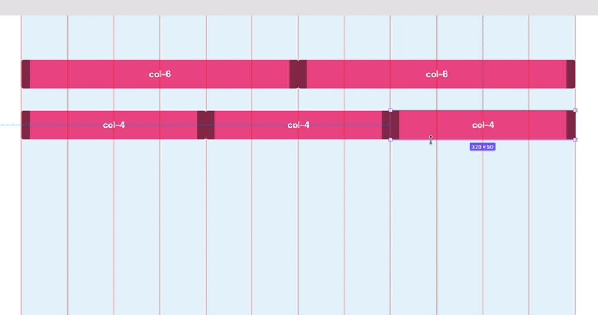

총 3가지 개념을 알아야하는데, 바로 container, column, gutter이다. 

* **container**는 grid system이 적용되는 모든 영역을 뜻한다. 
* **column**은 이 container를 몇 개로 나누느냐를 나타내는데 보통 12 column을 많이 사용한다. 12는 2로도, 3, 4, 6으로도 나누어지기 때문이다. column 개수가 정해지면, width를 막 정하는 게 아니라, column 2개, 3개 등의 방식으로 정하게 된다. 
* gutter는 아이템 사이의 여백을 의미한다. 

### Bootstrap 

**Grid System을 css로 쉽게 구현**할 수 있도록 도와주는 **css framework**! 심지어 **반응형**까지 대응! 

**사용법 :** Bootstrap 홈페이지 접속 후 Introduction 부분의 css만 복사해 html에 붙여넣어주면 된다. 

bootstrap을 제대로 사용하려면 아래의 **rule**을 꼭 지켜주어야 한다.  container 안에는 꼭 row가 와야 하고, row는 한 줄을 의미한다. 그 안에 col class를 넣어주고, 1개짜리 col이라면 col-1, 3개짜리 col이라면 col-3이라고 클래스명을 지어야 한다. 그리고 그 안에 원하는 요소를 넣어준다. 예를 들어, program이라는 class를 넣고 싶다면, container &gt; row &gt; col-x 안에 넣어줘야 한다. 

\*row는 한 줄을 의미한다 했는데, 만약 row 안에 col-1과 col-12를 넣게 되면 한 줄이 넘기 때문에, col-12는 자동으로 다음 줄로 넘어가게 된다. 

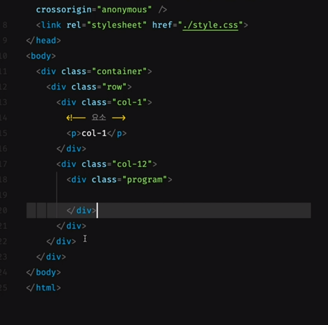

다음으로는 반응형에 적용 가능한 '신기한' 기술이 있다. 576px 이전에는 12개짜리 col, 768px 이전에는 6개짜리 col, 992px 이전에는 4개짜리 col과 같은 식으로 자동으로 처리되게 할 수 있다. 아래의 이미지를 참고해서 원하는대로 활용하면 된다. 

```css
<div class="container">
      <div class="row">
        <div class="col-12 col-sm-6 col-md-4 col-lg-3 col-xl-2">
          <p>
            Column 
          </p>
        </div>
      </div>
</div>
```

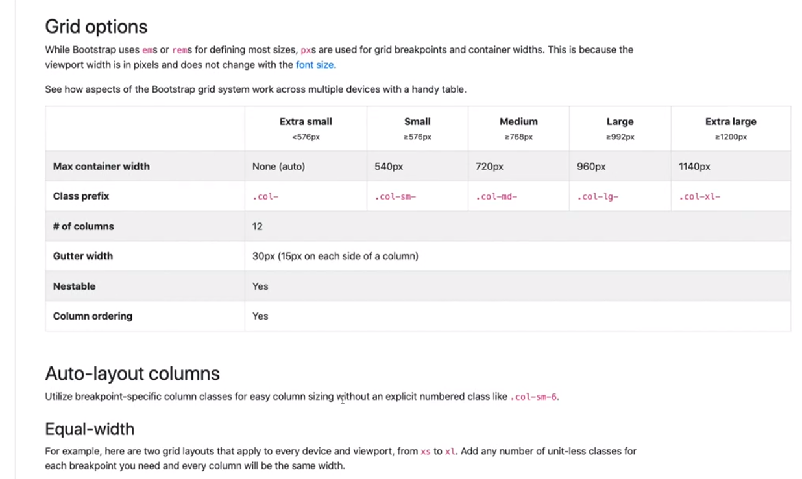

### 


