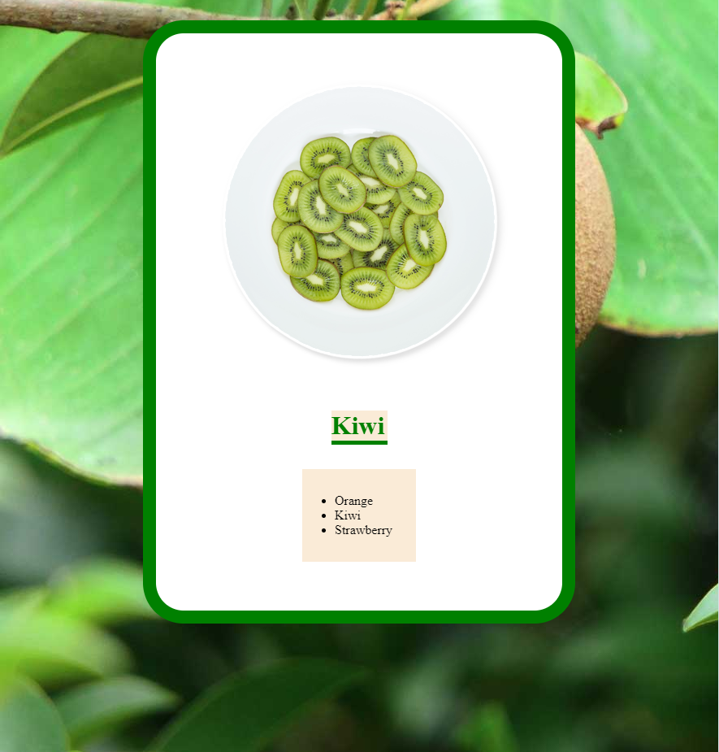

# Css

## HTML+CSS의 기본

아래와 같은 페이지를 만들려면 어떻게 해야할까?



html 파

```markup
<!DOCTYPE html>
<html lang="en">
<head>
  <meta charset="UTF-8">
  <meta name="viewport" content="width=device-width, initial-scale=1.0">
  <title>Kiwi</title>
  <link rel="stylesheet" href="kiwi.css">
</head>
<body>
  <div>
    
    <h1>
      Kiwi
    </h1>
    <ul>
      <li>
        Orange
      </li>
      <li>
        Kiwi
      </li>
      <li>
        Strawberry
      </li>
    </ul>
  </div>
</body>
</html>
```

css 파일

```css
body{
  /* url() 주의 */
  background-image: url(images/kiwi-bg.jpg);
}

div{
  background-color: white;
  width:400px;
  
  /* padding은 내부에 생기는 공간, 총 가로 길이는 500이 된다 */
  padding: 30px 50px;

  /* 좌우가 auto라는 뜻은 화면 크기를 조정함에 따라 자동으로 조절됨을 의미 */
  margin: 30px auto 50px;
  border: 16px solid green;
  border-radius: 50px;
}

h1{
  color:green;
  border-bottom: 5px solid green;
  background-color: antiquewhite;
  /* width 먼저 정한 후 margin 조*/
  width: 69px;
  margin: 30px auto;

}

ul{
  background-color: antiquewhite;
  /* width를 먼저 정한 후, margin, padding 조절 */
  width: 100px;
  margin: 30px auto;
  padding-top: 30px;
  padding-bottom: 30px;
}

```


