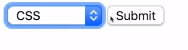
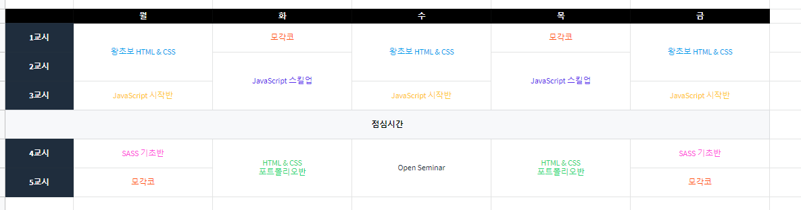
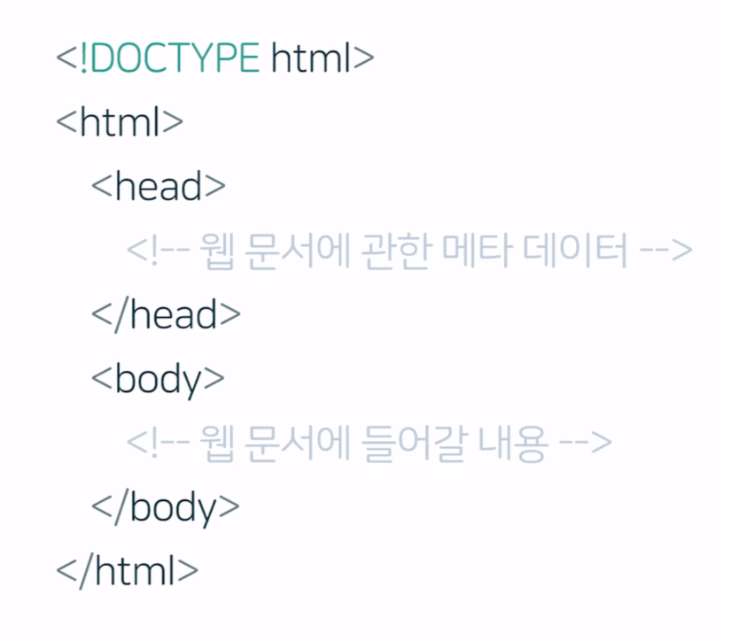

# Html

## Html이 왜 중요한가 

* 우리가 어떤 사이트를 들어가기 위해 url을 타이핑하고, enter를 누르면, 해당 사이트의 서버가 브라우저에게 그 사이트의 정보를 넘겨주게 된다. **그 정보**가 바로 _**html, css, javascript**_이다. 
* 그 중에서도 html이 중요한 이유는 html이 없으면, css도, javascript도 소용없기 때문이다. _**모든 정보들은 html의 태그를 통해 표현 가능**_하기 때문에, html을 잘 아는 것이 중요하다.
* 또한, **문서의 구조와 정보 위계가 명확하게 보이는** html 코드를 작성해야 한다. 

## Html을 semantic하게 작성해야 하는 이유 

* html을 왜 의미에 맞추어 작성해야 할까? 개발은 팀플레이다. 남이 내가 짠 코드를 알아보는 것도 힘들지만, 나 역시 코드를 짜고 며칠만 지나도 알아보기가 힘들다. 
* So, div 떡칠하지 않고, 의미에 맞춰서 작성하면 나중에 찾는 게 쉬워진다. 
* 그렇다면, 내가 semantic하게 작성했는지 어떻게 알 수 있는가? 내가 _왜 이렇게 코드를 짰는지 설명할 수 있다면_  잘 짠 것이다. 

## Attribute

&lt;p&gt;, &lt;h1&gt;과 같은 태그로 표현이 안 되는 부분을 추가적으로 표현할 수 있는 기능이다. 

```markup
<p lang="ru"> lang="ru" << 이 부분이 바로 attribute다. 
이 attribute을 통해 러시아어로 쓰인 문장이라는 정보를 
넘겨주게 된다.</p>
```

## Strong, em

강조의 태그. 브라우저한테 내가 특정 내용을 강조하고 싶다는 것을 알리는 태그. 

## Anchor

링크 태그. 현 위치에서 다른 위치로의 이동이 필요할 때 사용. **href**\(hypertext reference: 주소값\)를 꼭 포함해주어야 함. 

* url, 웹페이지 내 이동 =&gt; href = \#id
* 메일쓰기 =&gt; href = mailto:메일주소
* 전화걸기 =&gt; href = tel:전화번호
* 원래 있던 페이지는 그대로 두고, 새탭에서 열고 싶을때 =&gt; target="\_blank" attribute 추가 

## Img

이미지 태그. attribute로는 src, alt가 있음. 

* src: source
* alt: alternative text, 대체 텍스트, 네트워크가 느려서 이미지가 안 뜨는 상황을 대비해 본래 어떤 이미지인지에 대한 대체 텍스트를 넣어주는 것 

## List

리스트 태그. 목록을 사용하고 싶을 때 사용. ol, ul, li이 있음.

* ol: ordered list
* ul: unordered list
* li: list item, _ul과 ol의 자식요소는 오직 li만 가능._ 
* 브라우저에게 이건 ul이다, ol이다 알려주는 것이 중요한 것이지, bullet이 붙고 안 붙고는 그다지 중요하지 않다.  

## Description list

정의 리스트. 용어를 정의할 때, key - value로 정보를 제공할 때 사용. 

* dl: description list
* dt: description term, key 값에 해당, dt 안에 아래의 '학습'과 같은 definition이 들어감.
* dd: description data, value 값에 해당 
* dl의 자식요소는 오직 div, dt, dd만 가능하다. 

```markup
<dl class="">
  <dt>학습 學習 [학씁]</dt>
  <dd>1. noun 배워서 익힘.</dd>
  <dd>2. noun 심리 경험의 결과로 나타나는, 비교적 지속적인 행동의 변화나
   그 잠재력의 변화. 또는 지식을 습득하는 과정</dd>
</dl>
```

## Quotations

인용 태그, blockquote, q.

* &lt;blockquote&gt; 인용할 내용 &lt;/blockquote&gt;: 브라우저로 하여금 인용한 내용을 가져왔다는 것을 알게함
* 인용 내용의 출처를 알려주고 싶을 때는 blockquote 태그 안에 &lt;cite&gt;출처&lt;/cite&gt; 태그를 넣어줌. 
* 그런데, 어느 사이트에서 인용문을 가져왔다면 blockquote 태그 안에 cite 주소를 명시해줄 수도 있음. 
* **blockquote가 블록 단위**로 인용할 때 사용하는 태그라면, **q태그**는 문단 안에서 **일부만** 인용 했을 경우 사용한다. 

```markup
<blockquote cite="https://edu.goroom.io">
  우리가 겪을 수 있는 가장 아름다운 체험은 신비다.<br/>
  신비는 모든 참 예술과 과학의 근원이다.
  <cite>알버트 아인슈타인</cite>
</blockquote>

<p><q>It's not happy news for the emperor penguin.</q> said 
Hal Castellan of the U.S. Woods Hole Oceanographic Institution, 
a co-author of the study in the journal Nature Climate Change.</p>
```

##  Div & Span

아무런 의미가 없음. css 스타일링할 때, 요소를 묶어야 할 때 요긴하게 사용됨. div는 좀 큰 단위, span은 문장 안에서 주로 사용된다. 

## Form\(1\) - 기본구조

사용자로부터 인풋Input을 받기 위한 태그.  

* &lt;form **action**="" **method**=""&gt; &lt;/form&gt;
* **action="API 주소"** 와 **method="GET \| POST"** 라는 attribute을 꼭 지정해줘야 함 
* 사용자한테 Form을 작성하게 했다면, 반응이 일어나야 함.  즉, Form을 받아서 처리해 줄 서버의 누군가에게 전달해줘야 함. 그 누군가를 명시해주는 것이 바로 **action="API 주소**_**\(처리해 줄 API 서버쪽 친구에게 접근가능한 URL&lt;=백엔드 개발자에게 물어보면 됨\)**_**"**
* method는 _중요한 정보가 있거나, 정보의 양이 엄청 많을때_는 **POST**라는 값을 넣고, _그렇지 않을 때는 웬만하면_ **GET**을 써주면 된다. 

##  Form\(2\) - Input

input은 사용자에게 어떤 정보나 데이터를 받을 때, 필드를 생성하는 가장 기본적인 태그

* &lt;input type ="~~~~"/&gt;
* 입력창, 인풋 필드 Input field와 동의어 
* **type="?"** 이라는 attribute을 반드시 적어주어야 함, text, email, password, number, tel, file and more...

### \# type="text"일때

* ,blank 되어 있는 박스에 기본적으로 보여줄 텍스트를 넣고 싶다면 **&lt;input type="text"** _**placeholder="이름을 입력하세요"**_ **/&gt;**과 같이 **placeholder**라는 attribute을 넣어주면 됨 
* 아이디를 입력 받는 창에서, 13개 이상의 문자는 받고 싶지 않다면, **maxlength="13"**이라는 attribute을 추가해주면 된다. 실제로 입력해보면, 14개부터는 문자가 입력되지 않는다.  또, 최소 5개의 문자는 입력받아야 한다면, **minlength="5"**라는 attribute을 추가해줘야 한다.
* 무조건 입력받아야 하는 부분이 있다면, **required**라는 태그를 추가해주면 된다.  만약 그 박스에 사용자가 아무것도 입력하지 않으면, 제출할 수가 없다는 메시지가 뜨게 된다.  
* 사용자가 어떤 값도 입력할 수 없게 하고  싶다면, **disabled**라는 태그를 추가해주면 된다. 
* Input field에 **초기값**을 미리 넣어두고 싶다면, **value**라는 attribute에 그 값을 넣어두면 된다. 예를 들어, 이름을 넣는 창에 홍길동이라고 미리 지정해두고 싶다면, value="홍길동"이라는 attribute을 넣으면 된다. _placeholder와의 차이점은 value는 그 값이 복사가 가능_하다는 점이다. 그리고 placeholder는 아무것도 입력이 되지 않았을 때의 안내문구이므로 value와는 다르다.  

### \# type = "email"일때

* 사용자가 인풋 값으로 email을 넣었는지, 안넣었는지 사전에 유효성 검사를 해주는 것 
* 사용자가 email 이외의 내용을 넣으면, 서버에 그 내용이 전달되지 않고, 잘못 입력했다는 문구가 뜬다. 

### \# type= "password"일때

* 사용자가 인풋\(비밀번호\)을 입력하면 보이지 않게 동그라미 처리를 자동으로 해준다. 
* 비밀번호 최소 6자리 이상으로 해서 입력받고 싶을 경우, minlength="6"이라는 attribute을 추가해준다.  

### \#type = "url"일때

* &lt;input type="url" placeholder="포트폴리오 URL을 적으시오"/&gt;와 같이 표현 가능
* 이때, url 외의 다른 값이 입력되면 이 역시 서버로 값이 전송되지 않고, 제대로된 url을 입력하라는 알림 문구가 뜨게 된다. 

### \# type = "number"일때

* &lt;input type="number" placeholder="숫자를 입력하세요"/&gt;와 같이 표현 가능
* 이때, 문자를 입력하게 되면 서버로 값이 전송되지 않고, 숫자를 입력하라는 알림 문구가 뜨게 된다. 
* 숫자의 범위를 제한하고 싶다면, &lt;input type="number" min="12" max="122" placeholder="숫자를 입력하세요\(12이상 ~ 122이하\)"/&gt;와 같이 표현할 수 있음. minlength와 maxlength는 문자나 숫자 길이를 제한하는 것이지만, min과 max는 숫자, 값 그 자체를 제한하는 것

### \# type = "file"일때

* &lt;input type="file" accept=".png, .jpg"&gt;와 같이 표현할 수 있음
* 이때, accept라는 attribute은 해당 확장자의 파일만을 선택할 수 있다는 것을 의미함, 위의 예시의 경우 사용자가 가지고 있는 수많은 파일 중, png와 jpg 파일만 선택 가능함을 의미 

## Form\(3\) - Label

&lt;label&gt; 라벨 &lt;/label&gt;, 폼 양식에 이름을 붙이는 태그 

* 다양한 인풋들 중, 누구를 위한 라벨인지를 꼭 나타내주어야 함
* &lt;label for="누구"&gt; 라벨 &lt;/label&gt;
* 라벨을 클릭할 경우, 해당 인풋에 포커스가 들어온다. 
* user의 사용성 개선을 위해 중요한 태그! 

```markup
<label for="user-name"> 이름 </label>
<input type="text" id="user-name"/>
<!--user-name의 인풋에 '이름'이라는 라벨을 붙이는 코드 
특이하게, label의 id에는 #을 붙이지 않음 -->
```

## Form\(4\) - Radio & Checkbox

라디오 박스는 둘 중 하나만 선택 가능, 체크박스는 여러개 선택 가능한 Input

### Radio

* input의 type은 radio
* name은 두 가지 버튼이 같은 카테고리임을 알려주는 역할을 함. 즉, 구독중과 미구독은 모두 subscription이라는 카테고리 아래에 있음을 알려줌. 
* value는 구독중과 미구독을 구별해주는 역할을 함. 

```markup
<form action="" method="GET">
  <input type="radio" name="subscription" value="1" 
  id="subscribed"/>
  <label for="subscribed">구독중</label>
  <input type="radio" name="subscription" value="0" 
  id="unsubscribed"/>
  <label for="unsubscribed">미구독</label>
  <button type="submit">
  Submit
  </button>
</form>
```

### Checkbox

Radio와 동일하게 코드를 작성하되, input type만 checkbox로 변경해주면 된다. 

## Form\(5\) - Select & Option



```markup
<form action="" method="GET">
<!--skill이라는 id를 위한 라벨임을 알려주는 코드 -->
  <label for="skill">스킬</label>
<!--select의 name과 value는 서버에게 전달을 하기 위해 나타내는 정보 -->
  <select name="skill" id="skill">
  <!--HTML을 선택할 경우, skill=html이라고, url 뒷 부분에 표시된다. -->
    <option value="html">HTML</option>
  <!--CSS을 선택할 경우, skill=css이라고, url 뒷 부분에 표시된다.-->
    <option value="css">CSS</option>
  <!--JavaScript을 선택할 경우, skill=js이라고, url 뒷 부분에 표시된다.-->
    <option value="js">JavaScript</option>
  </select>
  <button type="submit">
    Submit
  </button>
</form>
```

##  Form\(6\) - TextArea

text는 많은 양의 텍스트를 입력할 수 없지만, textarea는 여러 줄을 입력 가능! 

```markup
<label for="introduction">자기소개</label>
<!-- 가로, 세로 길이도 설정 가능, placeholder도 설정할 수 있다. -->
<textarea id="introduction" rows="30" cols="50"
 placeholder="자기소개를 입력하세요."></textarea>
```

## Form\(7\) - Button

말 그대로 클릭하는 버튼, type이라는 attribute이 꼭 들어가야 한다!

```markup
<!--총 세가지 타입이 있다. submit은 서버에 정보를 넘겨줄 때, 
reset은 유저가 기입한 내용을 리셋하고 싶을때, button은 그 -->
<button type="button">Click!</button>
<button type="submit">Submit</button>
<button type="reset">Reset</button>
```

## 표 Table\(1\) - 기본 구조

table은 데이터를 담은 표를 만들 때 사용

```markup
<!-- table을 만드는 기본 원리 -->
<table>
 <!-- tr은 table row, 즉, 행 뜻함 -->
 <tr>
  <th>테이블헤더</th>
  <td>테이블데이터</td>
 </tr>
</table>

<table>
  <!--브라우저에게 구조를 잘 알려주기 위해 thead와 tbody를
  사용하는 것을 권-->
  <thead>
   <!--th는 볼드체로 표시된다, 제목이라고 보면-->
    <th>아이디</th>
    <th>이름</th>
    <th>개발분야</th>
    <th>기타</th>
  </thead>

  <tbody>
    <tr>
      <td>00001</td>
      <td>김버그</td>
      <td>프론트엔드</td>
      <!-- 기타라는 thead가 만들어졌으므로 빈칸이더라도
      td는 생성해두는 것이 좋-->
      <td></td>
    </tr>
    <tr>
      <td>00002</td>
      <td>홍길동</td>
      <td>풀스택</td>
      <td></td>
    </tr>
  </tbody>
</table>
```

## 표 Table\(2\) - 심화

style은 고려하지 않는다고 했을 때, 아래 사진과 같은 table을 어떻게 만들 수 있을까?  



```markup
<table>
  <thead>
    <tr>
      <!--텍스트가 들어가지 않아도 칸은 만들어주어-->
      <th></th>
      <!--브라우저에게 열의 header라는 것을 알려주는게 scope="col"-->
      <th scope="col">월</th>
      <th scope="col">화</th>
      <th scope="col">수</th>
      <th scope="col">목</th>
      <th scope="col">금</th>
    </tr>
  </thead>

  <tbody>
    <tr>
     <!--브라우저에게 의 header라는 것을 알려주는게 scope="row"-->
      <th scope="row">1교시</th>
      <!--2개의 행을 차지할때, rowspan="2"라고 -->
      <td rowspan="2">왕초보 HTML &amp; CSS</td>
      <td>모각코</td>
      <td rowspan="2">왕초보 HTML &amp; CSS</td>
      <td>모각코</td>
      <td rowspan="2">왕초보 HTML &amp; CSS</td>
    </tr>

    <tr>
      <th scope="row">2교시</th>
      <!--이미 위의 table row에서 2칸을 차지했기때문에 굳이 써주지 않아도 ok-->
      <!--<td rowspan="2">왕초보 HTML &amp; CSS</td>-->
      <td rowspan="2">JavaScript스킬업</td>
      <!--<td rowspan="2">왕초보 HTML &amp; CSS</td>-->
      <td rowspan="2">JavaScript스킬업</td>
      <!--<td rowspan="2">왕초보 HTML &amp; CSS</td>-->
    </tr>

    <tr>
      <th scope="row">3교시</th>
      <td>JavaScript시작반</td>
      <!--<td rowspan="2">JavaScript스킬업</td>-->
      <td>JavaScript시작반</td>
      <!--<td rowspan="2">JavaScript스킬업</td>-->
      <td>JavaScript시작반</td>
    </tr>

    <tr>
      <!--6개의 열을 차지할때, colspan="6"라고 표현-->
      <td colspan="6" scope="row">점심시간</td>
    </tr>

    <tr>
      <th scope="row">4교시</th>
      <td>SASS 기초반</td>
      <td rowspan="2">HTML &amp; CSS 포트폴리오반</td>
      <td rowspan="2">Open Seminar</td>
      <td rowspan="2">HTML &amp; CSS 포트폴리오반</td>
      <td>SASS 기초반</td>
    </tr>

    <tr>
      <th scope="row">5교시</th>
      <td>모각코</td>
      <!--<td rowspan="2">HTML &amp; CSS 포트폴리오반</td>-->
      <!--<td rowspan="2">Open Seminar</td>-->
      <!--<td rowspan="2">HTML &amp; CSS 포트폴리오반</td>-->
      <td>모각코</td>
    </tr>
  </tbody>
</table>

```

## Media 미디어 파일

### audio/video

* src는 항상 있어야 한다. 
* controls라는 attribute을 적어주어야만 재생 버튼과 음량 조절 버튼을  화면에서  확인할 수 있다. 
* autoplay라는 attribute을 적어주면, 해당 웹페이지를 열자마자 자동 재생이 가능하다.
* loop라는 attribute을 통해 반복 재생이 가능하다. 
* src를 따로 쓰는 경우가 있는데, 브라우저에 따라 \(audio\)mp3/ogg/wav \| \(video\)mp4/mov 등 각각 지원하지 않는 파일이 있을수 있으므로 이때를 대비해 파일을 여러 개 써준다. 

```markup
<!--화면에 재생버튼과 음량조절버튼이 뜬다-->
<audio src="../assets/audios/kimbug.mp3" controls>
</audio>
<!-- 열자마자 자동재생 그리고 반복되기를 원할때-->
<audio src="../assets/audios/kimbug.mp3" loop autoplay>
</audio>
<!--src를 따로 빼주는 경우-->
<audio controls>
  <source src="../assets/audios/kimbug.wav" type="audio/wav">
  <source src="../assets/audios/kimbug.mp3" type="audio/mpeg">
  <source src="../assets/audios/kimbug.ogg" type="audio/ogg">
  <!--위 3가지 파일 모두 없어서 재생이 불가능한 경우 띄워줄 문구-->
  <p>
    당신의 브라우저를 버리시고 크롬을 사용하시는게 어떨까요? 
  </p>
</audio>

<!--화면에 재생버튼과 음량조절버튼이 뜬다-->
<video src="../assets/videos/kimbug.mp4" controls>
</video>
<!-- 열자마자 자동재생 그리고 반복되기를 원할때-->
<video src="../assets/videos/kimbug.mp4" loop autoplay>
</video>
<!--src를 따로 빼주는 경우-->
<video>
  <source src="../assets/videos/kimbug.mov" type="video/mp4">
  <source src="../assets/videos/kimbug.mp4" type="video/mp4">
  <!--위 2가지 파일 모두 없어서 재생이 불가능한 경우 띄워줄 문구-->
  <p>
    브라우저를 업데이트 하심이 어떠신지요?
  </p>
  <a href="https://browsehappy.com">브라우저 업데이트하기</a>
</video>
```

### iframe

또다른 html문서나 컨텐츠를 집어넣고 싶을 때 사용. iframe 코드를 직접 작성할 경우는 거의 없음.  가령, 유튜브에 들어가서 원하는 영상을 클릭&gt;share&gt;embed&gt;iframe 코드 복사 후 내 코드에 붙여넣기를 하면 된다!

```markup
<iframe width="560" height="315" src="https://www.youtube.com/embed/3pT_aBW_pdg" 
frameborder="0" allow="accelerometer; autoplay; encrypted-media; gyroscope; 
picture-in-picture" allowfullscreen></iframe>
```

## Etc 기타

### abbreviation 약자, 약어

해당 단어 위에 마우스를 올리면 설명이 나오도록 하는 태그, title은 설명을 적어주는 attribute이기 때문에 꼭 포함해주어야함

```markup
<p>
  너... 혹시 <abbr title="Attention Deficit Hyperactivity Disorder">ADHD</abbr>니?
</p>
```

### address 주소

연락처에 관한 정보를 마크업할때 사용하는 태그. 물리적 주소, URL, email 주소, 전화번호, SNS가 이에 해당.

```markup
<address>
  <h1>
  김버그
  </h1>
  <a href="https://youtube.com/c/kimbug">https://youtube.com/c/kimbug</a>
</address>
```

### Pre, code 코드

html 문서 상에서 코드를 작성하고 싶을 때 사용. p태그는 엔터를 쳐도 화면 상에서는 엔터로 표현되지 않지만, pre태그를 사용하면 표현이 가능하다. 

```markup
<!--여러 줄의 코드를 작성할때는 pre태그 사용-->
<pre>
<code>
 console.log('hello kimbug');
 <!--한 칸 띄어쓴 것도 출력 화면에는 그대로 반영된다-->
  var kimbug = 'kimbug';
</code>
</pre>

<!--한 줄의 코드만 작성할때는 code태그만 사용 가능-->
<code>
  console.log('hello kimbug');
</code>

```

## Doctype & Document Structure

* 모든 html 문서를 작성할 때 가장 먼저 해줘야 하는 것이 Doctype 선언! Doctype이란 document type, 즉, 문서 형식 선언이다. &lt;!DOCTYPE html&gt;이란 브라우저에 이 문서는 HTML5 버전으로 작성된 문서라는 것을 알려주는 코드이다. 즉, 브라우저에 오류 없이 잘 렌더링해달라는 선언이기도 함. 
* 이제 html 태그를 쓰면 되는데, head와 body만을 포함할 수 있다. 
* head 태그는 웹 문서에 관한 메타 데이터를 담으면 된다. 
* body 태그는 웹 상에서 보여질 내용, 콘텐츠 그 자체를 담으면 된다. 



## Title, Link, Style & Script

### Title 문서의 대제목 

&lt;title&gt;문서의 대제&lt;/title&gt;. 검색 최적화에 매우 중요. 

title 잘 쓰는 방

* 키워드 단순 나열은 비
* 페이지마다 그에 맞게 변경
* 무엇에 관한 내용인지 센스있게 잘 작성하는 게 중

### Link

css 스타일시트를 첨부하는 태그 

```markup
<!DOCTYPE html>
<html lang="en">
  <head>
    <meta charset="utf-8">
    <title>김버그의 버그없는 HTML과 CSS</title>
    <link rel="stylesheet" href="./styles.css">
  </head>
  <body>
    <h1>kimbug</h1>
  </body>
</html>
```

### Style & Script

style 태그는 html 문서 내에 css 코드를 작성할 때. script 태그는 html 문서 내에 JavaScript 파일을 첨부할  때 사용. 

* style 태그는 웬만하면 사용하는 것을 비추. 왜냐하면 아무리 열심히 styles.css에 스타일 관련 코드를 작성해두어도, style 태그를 쓰는 순간 style 태그가 그걸 다 덮어버리기 때문이다. 
* script 태그 내에 source를 포함해서 쓰거나, style 태그처럼 그 즉시도 구현 가능하다. 
* script 태그는 렌더가 다 될때까지 기다리기 때문에, 중간에 넣을 경우 비효율적일수있다. 그래서 항상 body 마지막 부분에 쓴다. 

```markup
<!DOCTYPE html>
<html lang="en">
  <head>
    <meta charset="utf-8">
    <title>김버그의 버그없는 HTML과 CSS</title>
    <link rel="stylesheet" href="./styles.css">
  </head>
  <body>
    <h1>kimbug</h1>
    <script src="./app.js"></script>
    <script>
      var h1 = document.querySelector('h1');
      h1.addEventListener('click', function(event){
        this.textContent = 'hi';
      })
    </script>
  </body>
</html>
```

## Meta

name과 content라는 attribute은 꼭 작성해줘야 함. name은 메타데이터의 종류, content는 메타데이터 값이다. 

```markup
<!DOCTYPE html>
<html lang="en">
  <head>
    <meta charset="utf-8">
    <meta name="viewport" content="width=device-width, initial-scale=1.0">
    <meta name="author" content="김버그">
    <meta name="description" content="~~">
    <meta name="keywords" content="김버그, 구름강의, 구름Edu">
    <title>김버그의 버그없는 HTML과 CSS</title>
    <link rel="stylesheet" href="./styles.css">
  </head>
  <body>
    <h1>kimbug</h1>
  </body>
</html>
```

