# Html 훈련

## \(1\) Ad Banner

다음과 같은 배너는 어떻게 만들 수 있을까? 생각보다 어렵지 않다. 세 가지 부분으로 나눈다는 것을 인지하면 그 다음은 간단하다. 다음 배너는 크게 _제목/부연 설명/클릭, 이렇게 세 부분으로 나눌 수 있다_. 제목은 h1 태그를 사용해서, 부연 설명은 p 태그로, 클릭을 하면 어딘가로 넘어가기 때문에 a 태그를 사용해주면 된다. **스타일은 css 파일을 통해서 구현 가능하므로 신경쓰지 않고 코드를 짜면 된다!!!** 

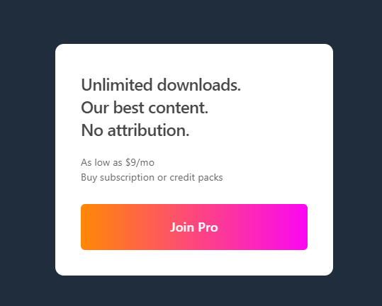

```markup
<!DOCTYPE html>
<html lang="en">
<head>
  <meta charset="UTF-8">
  <meta name="viewport" content="width=device-width, initial-scale=1.0">
  <title>Ad Banner</title>
  <link rel="stylesheet" href="./styles.css">
</head>
<body>
  <div class="modal">
    <h1>Unlimited downloads. <br/>
        Our best content. <br/>
        No attribution.
    </h1>
    <p>
      As low as $9/mo <br/>
      Buy subscription or credit packs
    </p>
    <!-- Join Pro를 누르면 다른 탭으로 넘어가게 하기 위해 target 사용 -->
    <a href="#" target="_blank">
      Join Pro
    </a>
  </div>
</body>
</html>
```

## \(2\) Google Search Result Item

구글에 무언가를 검색하면 아래와 같은 화면이 나타난다. 제목 / 링크 / 설명, 이렇게 세 부분으로 나눌 수 있다. 제목은 h1 태그를 사용하면 되는데, 주의할 점은 웹에서 _제목을 눌러도 사이트로 넘어가기 때문에_, **h1 태그 안에 a 태그를 사용**해서 제목과 링크 두 가지 기능을 하도록 해야한다. 링크는 a 태그를 사용해주면 되고, 설명은 p 태그를 사용해주면 되는데, 잘 보면 &lt;div&gt;, &lt;span&gt;이라는 단어가 있는데, 브라우저 입장에서는 이 단어를 태그로 이해할 수 있기 때문에, **&lt;과 &gt;를 각각 &lt;\(less than\)와 &gt;\(greater than\)로 작성**해주어야 한다. 

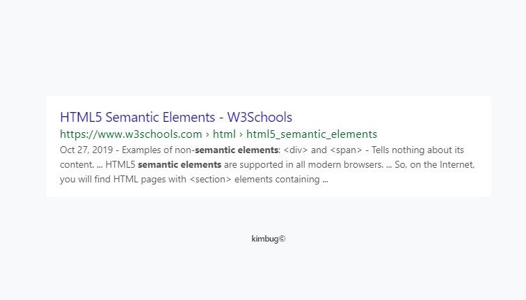

```markup
<!DOCTYPE html>
<html lang="en">
<head>
  <meta charset="UTF-8">
  <meta name="viewport" content="width=device-width, initial-scale=1.0">
  <title>Google Search Result Item</title>
  <link rel="stylesheet" href="./styles2.css">
</head>
<body>
  <div class="google-search-result-item">
    <h1>
      <a
       href="https://www.w3schools.com/html/html5_semantic_elements.asp">
       HTML5 Semantic Elements - W3Schools
      </a>
    </h1>
    <a
     href="https://www.w3schools.com/html/html5_semantic_elements.asp">
     https://www.w3schools.com › html › html5_semantic_elements
    </a>
    <p>
      Oct 27, 2019 - Examples of non-<strong>semantic elements</strong>: 
      &lt;div&gt; and &lt;span&gt; - Tells nothing about its content. ... HTML5
       <strong>semantic elements</strong> are supported in all modern browsers. 
       ... So, on the Internet, you will find HTML pages with &lt;section&gt; 
       elements containing ...
    </p>
  </div>
</body>
</html>

```

## \(3\) Feature Box

웹사이트에서 종종 아래와 같은 화면을 볼 수 있다. 그 중, 첫번째 사진과 글에 대해 코드를 짜보려고 한다. 사진과 제목, 부연설명으로 이루어져 있어 간단하지만 주의해야 할 사항이 두 가지가 있다. 

1. img 태그에는 경로를 지정하는 src 외에, 이미지가 없을 경우를 대비한 대체 텍스트인 alt라는 attribute을 꼭 넣어주어야 한다. 설령, 뭐라고 적어야 할지 모르겠거나 딱히 설명이 필요한 부분이 아니더라도 alt=""로 비워두면 된다. 
2. html은 정보를 나타내기 위한 언어인데, 개발자에 따라서는 이미지를 정보의 영역이 아닌 디자인의 영역으로 생각하는 경우도 있다. 그럴 경우, img 태그 없이 div class에 no-image라는 attribute을 추가해 css에서 이미지 부분을 해결할 수도 있다. 

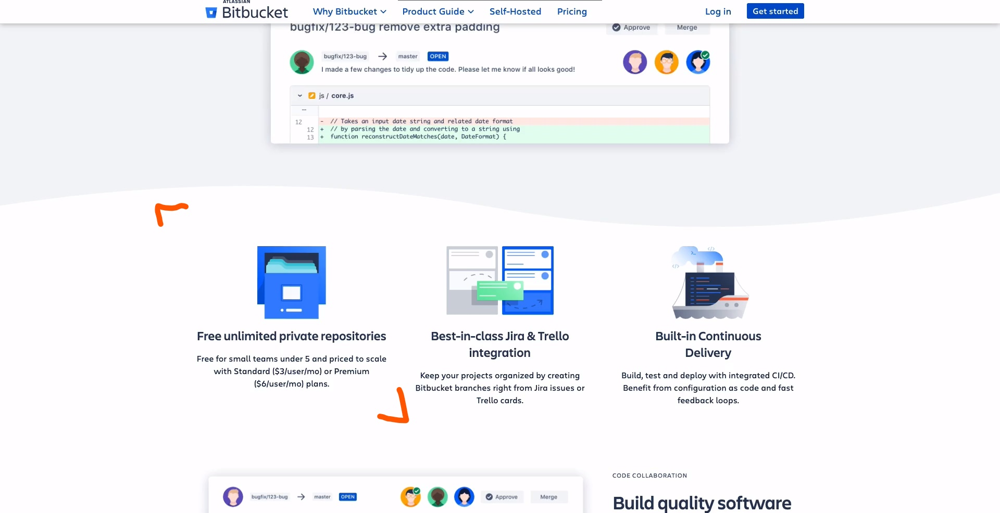

그러면 코드로 확인해보자. 

```markup
<!-- 이미지를 html에 포함시키는 경우 -->
<!DOCTYPE html>
<html lang="en">
<head>
  <meta charset="UTF-8">
  <meta name="viewport" content="width=device-width, initial-scale=1.0">
  <title>Feature Box</title>
  <link rel="stylesheet" href="./styles3.css">
</head>
<body>
  <div class="feature-box">
    
    <h1>
      Free unlimited private repositories
    </h1>
    <p>
      Free for small teams under 5 and priced to scale with Standard ($3/user/mo) or Premium ($6/user/mo) plans.
    </p>
  </div>
</body>
</html>

<!-- 이미지를 css에 포함시키는 경우 -->
<!DOCTYPE html>
<html lang="en">
<head>
  <meta charset="UTF-8">
  <meta name="viewport" content="width=device-width, initial-scale=1.0">
  <title>Feature Box</title>
  <link rel="stylesheet" href="./styles3.css">
</head>
<body>
  <div class="feature-box no-image">
    <!--  -->
    <h1>
      Free unlimited private repositories
    </h1>
    <p>
      Free for small teams under 5 and priced to scale with Standard ($3/user/mo) or Premium ($6/user/mo) plans.
    </p>
  </div>
</body>
</html>
```

## \(4\) Logo in Header

다음과 같은 헤더를 만들 때 주의할 점은,

* 로고는 페이지의 제일 중요한 부분이니 텍스트가 아닌 이미지를 넣는다하더라도, h1 태그로 감싸준다. 
* q&a의 &은 브라우저가 오해할 수 있는 부분이므로, &amp;로 써야 한다. 
* 로고와 q&a 모두 링크를 걸어야 하는 것을 잊으면 아니된다! 
* 이미지의 alt, 꼭 빼먹지 않고 써준다. 

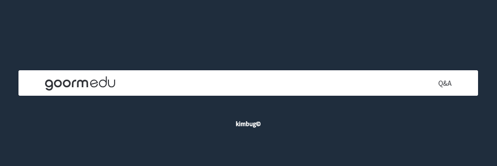

```markup
<!DOCTYPE html>
<html lang="en">
<head>
  <meta charset="UTF-8">
  <meta name="viewport" content="width=device-width, initial-scale=1.0">
  <title>Logo in Header</title>
  <link rel="stylesheet" href="./styles4.css">
</head>
<body>
  <div class="header">
    <h1>
      <a href="./logoinheader.html">
        
      </a>
    </h1>
    <p>
      <a href="https://edu.goorm.io/qna">
        Q&amp;A
      </a>
    </p>
  </div>
</body>
</html>
```

## \(5\) Breadcrumb & Pagination

아래 사진이 차례로 breadcrumb과 pagination을 나타낸 것이다. 주의해야할 점, 

* breadcrumb에서 '/'는 정보에 해당하지 않으므로 css로 처리한다. 
* 1, 2, 3, ... 이 부분은 orderd list로 감싸준다. 
* '...'는 button 태그로 감싸주고, 클릭할 수 없도록 disabled 시킨다. 그리고 button은 꼭 type이라는 attribute을 포함시켜야 한다! 
* 프론트엔드 개발자는 눈이 잘 보이지 않는 사람들을 위해 만든 **aria-label**이라는 국제 태그를 잘 활용해야한다. ex\) &lt;a href="\#" **aria-label="Go to page 1"**&gt;1&lt;/a&gt;

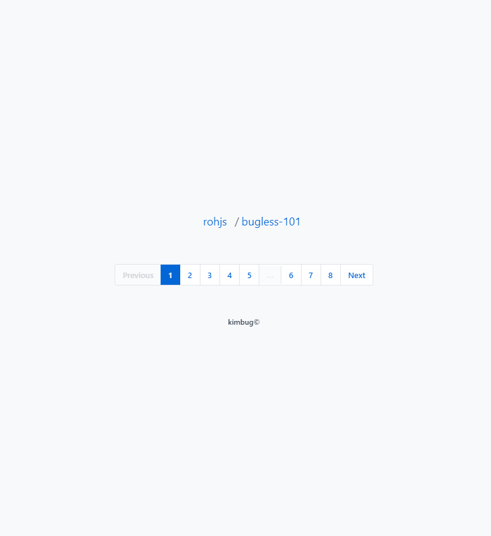

```markup
<!DOCTYPE html>
<html lang="en">
<head>
  <meta charset="UTF-8">
  <meta name="viewport" content="width=device-width, initial-scale=1.0">
  <title>Breadcrumb & Pagination</title>
  <link rel="stylesheet" href="./style5.css">
</head>
<body>
  <div class="breadcrumb">
    <a href="https://github.com/rohjs">
      rohjs
    </a>
    <a href="https://github.com/rohjs/bugless-101">
      bugless-101
    </a>
  </div>
  <div class="pagination">
    <a href="" aria-label="Current page. Go to previous page" class="disabled">
      Previous
    </a>
    <ol>
      <li class="current-page">
        <a href="" aria-label="Go to page 1">
          1
        </a>
      </li>
      <li>
        <a href="" aria-label="Go to page 2">
          2
        </a>
      </li>
      <li>
        <a href="" aria-label="Go to page 3">
          3
        </a>
      </li>
      <li>
        <a href="" aria-label="Go to page 4">
          4
        </a>
      </li>
      <li>
        <a href="" aria-label="Go to page 5">
          5
        </a>
      </li>
      <li>
        <button type="button" disabled>
          ...
        </button>
      </li>
      <li>
        <a href="" aria-label="Go to page 6">
          6
        </a>
      </li>
      <li>
        <a href="" aria-label="Go to page 7">
          7
        </a>
      </li>
      <li>
        <a href="" aria-label="Go to page 8">
          8
        </a>
      </li>
    </ol>
    <a href="" aria-label="Go to next page">
      Next
    </a>
  </div>
</body>
</html>
```

## \(6\) Product Card

아래와 같은 product card를 만들 때 주의할 점은, 

* lang="ko"로 설정해야 한다. 
* 이미지의 alt 값에 들어갈 설명이 어차피 책제목이기 때문에 비워두고, 책 제목을 h1 태그로 한다.
* 책 제목만큼은 아니더라도 중요한 정보라고 판단되는 '이병률', '오늘의 책', '9.4' 모두 strong 태그로 처리해준다. 
* screen reader로 이 정보를 듣게 되는 사람들의 입장에서는, '오늘의 책'이라고만 나오면 무슨 뜻인지 모를 수 있기 때문에, aria-label에 '오늘의 책 선정'이라고 해준다. 
* 같은 맥락에서 '이병률' 역시, aria-label에 '저자 이병률'이라고, '9.4'도 aria-label에 '평점 9.4'라고 해준다.
* 별점의 경우, css로 처리해줄 수도 있지만, fontawesome이라는 사이트에서 제공하는 코드를 활용하면 html로 간단히 표현 가능하기 때문에 html로 처리해주었다. 

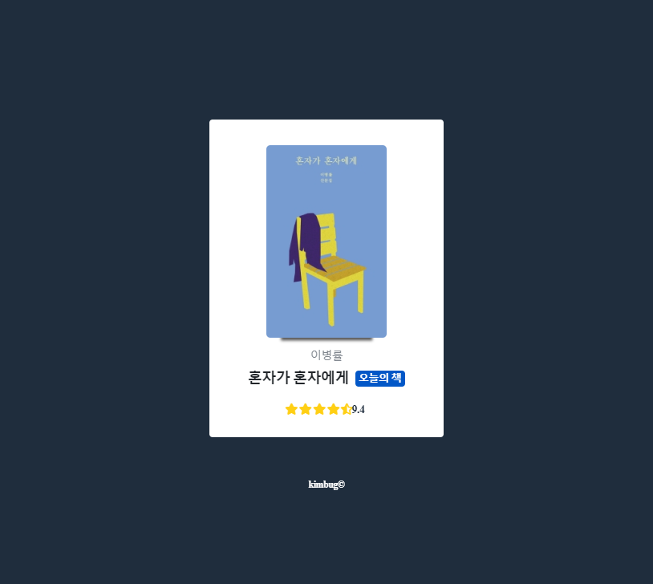

```markup
<!DOCTYPE html>
<html lang="ko">
<head>
  <meta charset="UTF-8">
  <meta name="viewport" content="width=device-width, initial-scale=1.0">
  <title>Product Card</title>
  <link rel="stylesheet" href="./styles.css">
  <script src="https://kit.fontawesome.com/64b6b61aad.js" crossorigin="anonymous"></script>
</head>
<body>
  <div class="product-card">
    <div class="product-card-image">
      
    </div>
    <div class="product-card-title">
      <h1>
        혼자가 혼자에게
      </h1>
      <strong aria-label="오늘의 책 선정">
        오늘의 책
      </strong>
    </div>
    <strong aria-label="저자 이병률" class="product-card-author">
      이병률
    </strong>
    <strong aria-label="평점 9.4" class="product-card-review">
      <span aria-hidden="true">
        <i class="fas fa-star"></i>
        <i class="fas fa-star"></i>
        <i class="fas fa-star"></i>
        <i class="fas fa-star"></i>
        <i class="fas fa-star-half-alt"></i>
      </span>
      9.4
    </strong>
  </div>
</body>
</html>

```

## \(7\) Instagram User Profile

다음은 Description List가 어떻게 쓰이는지 보기 위한 예제이다. 

* dl은 오로지 description term인 dt, description data인 dd만 요소로 가진다. 
* 단지, 사전을 위한 용도로만 쓰이는 것이 아니라 아래처럼 posts는 112개, followers는 274명, following은 238명... 이런 것들을 나타낼 때도 사용된다. 
* screen reader로 듣는 사람들을 위해 이미지보다는 중요한 정보를 먼저 제시하고, 이미지는 맨 뒤로 뺀다. 

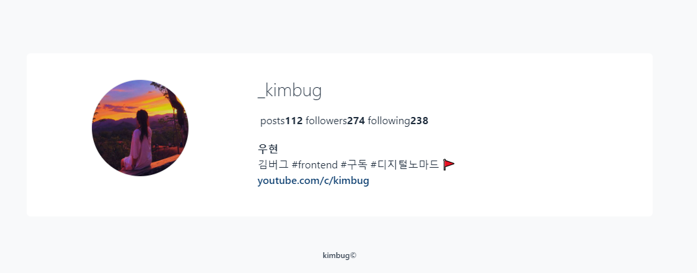

```markup
<!DOCTYPE html>
<html lang="en">
<head>
  <meta charset="UTF-8">
  <meta name="viewport" content="width=device-width, initial-scale=1.0">
  <title>Instagram User Profile</title>
  <link rel="stylesheet" href="./styles.css">
</head>
<body>
  <div class="user-profile">
    <div class="user-profile-data">
      <h1>
        _kimbug
      </h1>
      <dl>
        <!-- 보다 정확한 정보 전달을 위해 대문자 사용, 
      화면에 소문자로 표현되는 것은 css로 처리 -->
        <dt>
          Posts
        </dt>
        <dd>
          112
        </dd>
        <dt>
          Followers
        </dt>
        <dd>
          274
        </dd>
        <dt>
          Following
        </dt>
        <dd>
          238
        </dd>
      </dl>
      <h2>
        우현
      </h2>
      <p>
        김버그 #frontend #구독 #디지털노마드 🚩
      </p>
      <a href="https://www.youtube.com/c/kimbug">
        youtube.com/c/kimbug
      </a>
    </div>
    <div class="user-profile-photo">
      
    </div>
  </div>
</body>
</html>

```

## \(8\) Receipt

아래의 영수증처럼 만들기 위해 고려해야 할 사항은, 

* screen reader로 듣는 사람들은 '24.06.20xx'나 '0.5L의 L'가 무엇인지 모를 수 있으므로 aria-label을 써주는 게 좋다. 
* 중요하다고 생각되는 바코드 이미지나 total 가격은 strong 태그로 처리해준다. 
* 강의를 듣고 코드를 짜면서 **느낀점**: 중요한 요소를 파악하고 그에 맞게 표현해주는 것, screen reader로 듣는 사람들을 고려하여 코드 짜기, 중요하지 않은 이미지는 css로 처리해줄수도 있다는 것

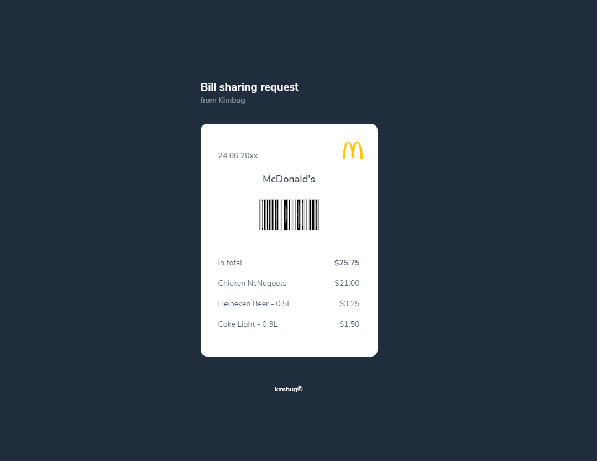

```markup
<!DOCTYPE html>
<html lang="en">
<head>
  <meta charset="UTF-8">
  <meta name="viewport" content="width=device-width, initial-scale=1.0">
  <title>Receipt</title>
  <link rel="stylesheet" href="./styles.css">
</head>
<body>
  <h1>
    Bill sharing request
    <span>
      from Kimbug
    </span>
  </h1>
  <div class="receipt">
    <span aria-label="Issued on June 24, 20xx">
      24.06.20xx
    </span>
    <h2>
      McDonald's
    </h2>
    <strong class="barcode">
      
    </strong>

    <div>
      <div>
        <dl>
          <dt>
            Coke Light - 0.3<span aria-label="litter">L</span>
          </dt>
          <dd>
            &dollar;1.50
          </dd>
        </dl>
      </div>
      <div>
        <dl>
          <dt>
            Heineken Beer - 0.5<span aria-label="litter">L</span>
          </dt>
          <dd>
            &dollar;3.25
          </dd>
        </dl>
      </div>
      <div>
        <dl>
          <dt>
            Chicken NcNuggets
          </dt>
          <dd>
            &dollar;21.00
          </dd>
        </dl>
      </div>
      <div>
        <dl>
          <dt>
            In total
          </dt>
          <strong>
            <dd>
              &dollar;25.75
            </dd>
          </strong>
        </dl>
      </div>
    </div>
  </div>
</body>
</html>

```

## \(9\) Github Dropdown Menu

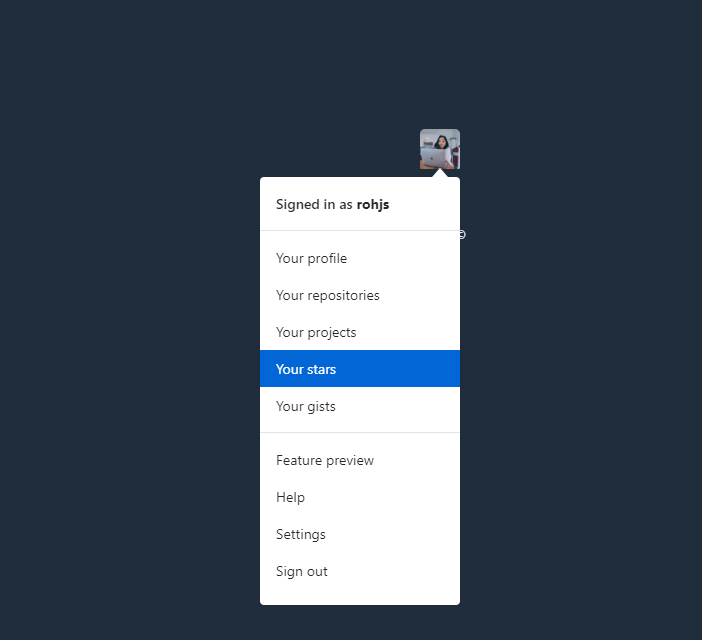

위와 같은 drop down menu를 만들면서 고려해야 할 사항은,

* 프로필 사진도 중요한 정보라고 보고, img 태그를 사용한다. 
* screen reader로 듣는 사람들을 위해, button의 aria-label에 'Open User Menu'라고 적어준다. 
* ol, ul의 자식요소는 li만 가능하다. So, a 태그를 li 안에 넣어준다. 
* 느낀점: 오늘도 역시, 정보의 중요도를 파악하며 마크업하며, screen reader를 위한 aria-label을 잘 작성하는 게 중요하다고 느낌. 

```markup
<!DOCTYPE html>
<html lang="en">
<head>
  <meta charset="UTF-8">
  <meta name="viewport" content="width=device-width, initial-scale=1.0">
  <title>Github Dropdown Menu</title>
  <link rel="stylesheet" href="./styles.css">
</head>
<body>
  <div class="dropdown">
    <button type="button" aria-label="Open User Menu" class="dropdown-button">
      
    </button>
    <div class="dropdown-menu">
      <h3>
        <a href="#">
          Signed in as <strong>rohjs</strong>
        </a>
      </h3>
      <ul>
        <li>
          <!-- ul이나 ol의 자식 요소로는 li만 올 수 있기 때문에 li 안에 a 태그 넣어줌 -->
          <a href="">
            Your profile
          </a>
        </li>
        <li>
          <a href="">
            Your repositories
          </a>
        </li>
        <li>
          <a href="">
            Your projects
          </a>
        </li>
        <li>
          <a href="">
            Your stars
          </a>
        </li>
        <li>
          <a href="">
            Your gists
          </a>
        </li>
      </ul>
      <ul>
        <li>
          <a href="">
            Feature preview
          </a>
        </li>
        <li>
          <a href="">
            Help
          </a>
        </li>
        <li>
          <a href="">
            Settings
          </a>
        </li>
        <li>
          <a href="">
            Sign out
          </a>
        </li>
      </ul>
    </div>
  </div>
  <script src="./app.js"></script>
</body>
</html>

```

## \(10\) Input Group

아래와 같은 인풋그룹을 만들 때 고려해야 할 사항은, 

* 가장 먼저 덩어리를 파악해야 한다. 아래의 경우, 제목/설명/인풋창/제출버튼 이렇게 나눌 수 있다. 
* form은 꼭 method라는 attribute을 적어주어야 한다. 
* input은 꼭 type을 정해주어야 하고, placeholder를 이용해서 문구를 띄워놓을 수 있다. 
* 'Subscribe' 버튼은 제출용이므로, button의 type은 submit으로 한다. 

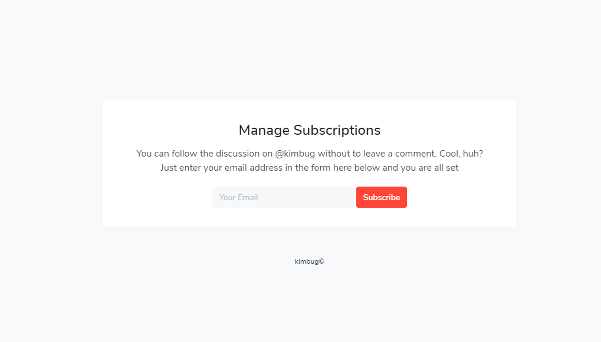

```markup
<!DOCTYPE html>
<html lang="en">
<head>
  <meta charset="UTF-8">
  <meta name="viewport" content="width=device-width, initial-scale=1.0">
  <title>Input Group</title>
  <link rel="stylesheet" href="./styles.css">
</head>
<body>
  <div class="subscription">
    <h1>
      Manage Subscriptions
    </h1>
    <p>
      You can follow the discussion on @kimbug without to leave a comment. 
      Cool, huh?<br/>
      Just enter your email address in the form here below and you are all set
    </p>
    <form action="" method="GET" class="input-group">
      <input type="email" placeholder="Your Email">
      <button type="submit">Subscribe</button>
    </form>
  </div>
</body>
</html>
```

## \(11\) Feed

아래와 같은 피드를 만들 때는, 

* 작은 요소들로 먼저 나눈다. 프로필 사진/닉네임/팔로우 버튼/글 작성 시간/글/Like 버튼/ Comment 버튼 / Comment 창 / Submit 버튼 
* '30 min'이라는 정보는 screen reader로 듣는 사람들은 뜬금 없을 수 있으므로, aria-label을 이용해 어떤 내용인지 알려주도록 한다. 
* comment 창은 여러 줄의 텍스트가 들어가므로, text 대신 textarea를 사용한다. 


```markup
<!DOCTYPE html>
<html lang="en">
<head>
  <meta charset="UTF-8">
  <meta name="viewport" content="width=device-width, initial-scale=1.0">
  <title>Feed</title>
  <link rel="stylesheet" href="./styles.css">
</head>
<body>
  <div class="feed">
    <div class="feed-user-profile">
      <a href="#">
        
      </a>
      <div>
        <h1>
          <a href="#">
            Kimbug
          </a>
        </h1>
        <span aria-label="Posted 30 minutes ago">
          30 min
        </span>
      </div>
      <button type="button">
        Follow
      </button>
    </div>
    <div class="feed-content">
      <p>
        The most beautiful experience we can have is the mysterious. It is the 
        fundamental emotion that stands at the cradle of true art and true 
        science. — Albert Einstein
      </p>
    </div>
    <div class="feed-footer">
      <button type="button">
        10 Likes
      </button>
      <button type="button">
        0 Comments
      </button>
    </div>
    <form action="" method="POST" class="feed-comment">
      <textarea placeholder="Write a comment"></textarea>
      <button type="submit">Submit</button>
    </form>
  </div>
  <script src="./app.js"></script>
</body>
</html>

```

## \(12\) Gmail Inbox

아래와 같은 메일 인박스를 만들때는, 

* 물론 리스트를 사용할 수도 있지만, 구획이 기준에 따라 나눠져 있으므로 테이블을 사용하는 게 좋다.
* 브라우저에게는 전달해야하지만, 보이고 싶지 않은 정보는 'sr-only'라는 class를 사용해, css에서 보이지 않도록 처리할 수 있다. 
* input은 label과 함께 사용하는 게 좋다. 
* tr은 table row 

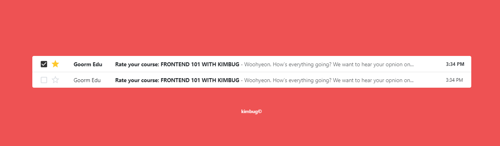

```markup
<!DOCTYPE html>
<html lang="en">
<head>
  <meta charset="UTF-8">
  <meta name="viewport" content="width=device-width, initial-scale=1.0">
  <title>Gmail Inbox</title>
  <link rel="stylesheet" href="./styles.css">
</head>
<body>
  <table class="inbox">
    <thead class="sr-only">
      <tr>
        <th scope="col">
          Actions
        </th>
        <th scope="col">
          Sender
        </th>
        <th scope="col">
          Title
        </th>
        <th scope="col">
          Time
        </th>
      </tr>
    </thead>
    <tbody>
      <tr class="unread">
        <td>
          <div class="inbox-actions">
            <div class="inbox-checkbox">
              <input type="checkbox" id="inbox-1">
              <label for="inbox-1" class="sr-only">Select this email</label>
            </div>
            <button type="button" class="inbox-star">
              <span class="sr-only">Add to favorites</span>
            </button>
          </div>
        </td>
        <td>
          Goorm Edu
        </td>
        <td>
          <a href="#">
            <strong class="sr-only">Unread:</strong>
            <strong>Rate your course: FRONTEND 101 WITH KIMBUG</strong>
            <span>- Woohyeon. How’s everything going? We want to hear your opnion on...</span>
          </a>
        </td>
        <td>
          3:34 PM
        </td>
      </tr>
      <tr class="read">
        <td>
          <div class="inbox-actions">
            <div class="inbox-checkbox">
              <input type="checkbox" id="inbox-1">
              <label for="inbox-1" class="sr-only">Select this email</label>
            </div>
            <button type="button" class="inbox-star">
              <span class="sr-only">Add to favorites</span>
            </button>
          </div>
        </td>
        <td>
          Goorm Edu
        </td>
        <td>
          <a href="#">
            <strong class="sr-only">Read:</strong>
            <strong>Rate your course: FRONTEND 101 WITH KIMBUG</strong>
            <span>- Woohyeon. How’s everything going? We want to hear your opnion on...</span>
          </a>
        </td>
        <td>
          3:34 PM
        </td>
      </tr>
    </tbody>
  </table>
  <script src="./app.js"></script>
</body>
</html>

```

