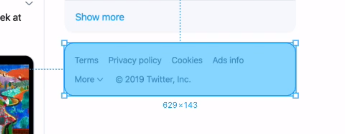

# 트위터 마크업 챌린지

## 올바른 Sectioning Elements 사용 방법 

먼저, **구조적으로 문서를 설계**한다는 것은 **글의 구조**가 쉽게 파악되도록 하는 것이다. 

이것이 중요한 이유는,  800페이지의 전공서를 읽는다고 했을 때, 무작정 읽는 것보다는 책의 개요를 파악하는 것이 좋다. 

* 몇 단원으로 구성되어 있는
* 각 단원의 제목은 무엇인지
* 소단원과 소단원의 주제는 무엇인지 

위의 요소들만 제대로 읽어도 글의 전개 흐름을 쉽게 파악할 수 있다. 또한 정보의 위계 질서도 파악할 수 있다. **브라우저**도 마찬가지로 **개요가 필요**하다. 이를 위해 사용하는 요소가 바로 **Sectioning Elements**이다. **Sectioning Elements**는 section, article, nav, aside로 총 4개다. sectioning elements는 일종의 **단원을 여는 것**이다. 단원에는 항상 주제, 제목이 있다. 그래서 Sectioning Elements 내에는 **반드시 heading 태그를 작성**해야 한다. 

```markup
<section>
  <h1>섹션의 제목</h1>
  <p>..............</p>
</section>

<nav>
  <h1>메뉴</h1>
  <ul>
    <li>
      <a href="#">링크</a>
    </li>
  </ul>
</nav>
```

## 페이지 구조 설계

'Html &gt; Html 훈련' 파트에서 UI Component의 코드를 짤때에는 최소한의 기능/의미를 갖는 가장 작은 단위로 쪼개보는 훈련을 했었다. 그 방식이 유효하긴 하지만, 앞으로는 조금 더 크게 구획으로 나눠볼 것이다. 논리적으로 긴밀하게 연결된 집합체끼리! 


위의 트위터 페이지를 마크업하기 전에 먼저 구획을 나눠보자! 어떻게 나눌 수 있을까? 


상단부 또는 도입부 / 피드 작성 폼 / 피드 / 트렌드 순위 / 팔로우 추천 목록 / 사이트 정보 ••• 정도로 나눌 수 있을 것 같다. 하지만 이는 문서를 작성하는 사람의 관점에 따라 충분히 달라질 수 있다. 

## Header

어떤 페이지의 상단부, 도입부를 담당하는 것이 바로 header이다. header는 div와 비슷하지만, div보다는 어떤 section의 상단부, 도입부의 뉘앙스가 느껴질 때 사용한다. 아래의 경우, 트위터의 로고가 있다. 그러므로 이는 전체 페이지에서 가장 중요한 부분, 대제목과 같은 부분이라고 할 수 있다. 그래서 header라고 판단한 것이다. 


우선, 트위터 로고 부분만 마크업해보겠다. 

```markup
<header>
  <!-- 트위터 로고가 페이지에서 가장 중요한 부분이라고 할 수 있으므로 h1 사용 -->
  <h1>
    <!-- 트위터 로고를 누르면 다시 트위터 메인으로 이동하므로 anchor 태그 사용 -->
    <a href="#">
      <!-- src는 그냥 생략하겠음 -->
      
    </a>
  </h1>
</header>
```

## Global Navigation

nav는 문서 페이지 간에 이동이 필요한 메뉴가 있는 경우 사용한다. 또한, nav는 sectioning elements에 포함되므로, 반드시 heading 태그를 포함해야 한다. 


위의 nav를 간단히 마크업해보자. 

```markup
<nav>
  <!-- nav는 sectioning elements이므로 반드시 heading 태그 포함 -->
  <h1>Global Navigation Menu</h1>
  <ul>
    <li>
      <a href="#">
        <span>Current Page</span>
        <!-- Icon -->
        Home
      </a>
    </li>
    <li>
      <a href="#">
        <!-- Icon -->
        Explore
      </a>
    </li>
    <li>
      <a href="#">
        <strong aria-label="5 Unread notifications">5</strong>
        <!-- Icon -->
        Notifications
      </a>
    </li>
    <li>
      <a href="#">
        <!-- Icon -->
        Messages
      </a>
    </li>
    <li>
      <a href="#">
        <!-- Icon -->
        Bookmarks
      </a>
    </li>
    <li>
      <a href="#">
        <!-- Icon -->
        Lists
      </a>
    </li>
    <li>
      <a href="#">
        <!-- Icon -->
        Profile
      </a>
    </li>
    <li>
      <button type="button">
        <!-- Icon -->
        More
      </button>
      <!-- Dropdown Menu -->
    </li>
  </ul>
  <button type="button">
    Tweet
  </button>
</nav>
```

## Main

main은 전체 페이지 내에서 가장 본격적인 컨텐츠가 시작하는 부분을 감싸기 위해 사용하는 것이고, html 내에서 단 한번밖에 사용하지 못한다. 그리고 main은 sectioning elements가 아니므로 heading 태그를 꼭 포함할 필요는 없다. 


main의 header 부분을 마크업해보자. 

```markup
<main>
  <header>
    <h1>
      Home
    </h1>
    <button type="button" aria-label="Timeline Options">
      <!-- Icon -->
    </button>
    <!-- button을 누르면 나오는 menu는 div로 묶어줌 -->
    <div>
      <h2>
        Home shows you top Tweets first
      </h2>
      <button type="button">
        <strong>
          See latest Tweets instead
        </strong>
        <span>You will be switched back Home after you've been away
        for a while.
        </span>
      </button>
      <a href="#">
        <!-- Icon -->
        View content preferences 
      </a>
    </div>
  </header>
</main>
```

## Tweet Form

아래의 트위터 폼을 마크하기 전에, 다음 사항들을 읽어보고 가자.

* section은 가장 만만하게 사용할 수 있는 sectioning elements이다. _논리적으로 완결된 집합체_일 경우, **div 대신 section**을 사용해서 마크업하면 되기 때문이다. 
* **form**에서 작성하는 _내용이 많을 경우_, method는 get 대신 '**post**'를 사용한다.
* **textarea**에서 입력 가능한 최대 길이를 설정하고 싶은 경우, '**maxlength**'를 사용한다. 
* **input의 type이 file**일때, 이미지든 비디오든 전부 허용하겠다는 의미에서 _multiple accept="image/\*, video/\*"라고 표현할 수 있다._ 


```markup
<section>
  <h1>
    What's happening? 
  </h1>
  <form action="#" method="post">
    
    <textarea placeholder="What's happening?" maxlength="280"></textarea>
    <button type="button" aria-label="Upload files">
      <!-- Icon -->
    </button>
    <input type="file" multiple accept="image/*, video/*">
    <button type="button" aria-label="Search GIFs...">
      <!-- Icon -->
    </button>
    <button type="button" aria-label="Create a poll">
      <!-- Icon -->
    </button>
    <button type="button" aria-label="Choose emoji">
      <!-- Icon -->
    </button>
    <strong aria-label="0 out of 280 characters">
    </strong>
    <button type="button" aria-label="Add another tweet">
      <!-- Icon -->
    </button>
    <button type="submit">Tweet</button>
  </form>
</section>
```

## Timeline

아래의 타임라인을 마크업하면서 주의할 점은, 

* 아래의 타임라인은 하나의 section으로 볼 수 있다. 
* section은 sectioning elements에 해당하므로, heading 태그를 반드시 작성해주어야 한다. 
* 타임라인에도 순서가 있다고 판단했으므로 ordered list를 사용해준다.


```markup
<section>
  <h1>
    Your Timeline
  </h1>
  <ol>
    <li>
      <!-- Tweet -->
    </li>
    <li>
      <!-- Tweet -->
    </li>
    <li>
      <!-- Tweet -->
    </li>
    <li>
      <!-- Tweet -->
    </li>
    <li>
      <!-- Tweet -->
    </li>
  </ol>
</section>
```

## Tweet

아래와 같은 트윗을 마크업하면서 주의할점은, 

* **article**은 sectioning elements로서, _블로그 글, 뉴스 기사, 트위터 피드_처럼 **정보 콘텐츠로서 완결성이 있는 독립적인 콘텐츠**일 경우, section보다 article을 사용하는 것이 뉘앙스를 전달하기 쉽다! 
* 프로필사진, 이름, 아이디, 포스팅날짜, 옵션 버튼은 tweet의 **상단부**에 해당하므로 **header**로 묶는다. 
* description list\[**dl**\], discription term\[**dt**\], discription data\[**dd**\], _dl의 자식 요소_는 오로지 _div, dt, dd_만 가능하다.
* comment, retweet, like, share 모두 **하단부**로 묶어 **footer**에 넣는다. 


```markup
<article>
  <h1>A Tweet from 김익명</h1>
  <!-- 전체 tweet에서 도입부에 해당하는 부분은 header로 -->
  <header>
    <a href="#">
      
    </a>
    <h2>
      <a href="#">
        김익명
      </a>
    </h2>
    <dl>
      <div>
        <dt>Username</dt>
        <dd>
          <a href="#">
            @anonymouskim
          </a>
        </dd>
      </div>
      <div>
        <dt>Posted</dt>
        <dd>
          <a href="#">
            Dec 25
          </a>
        </dd>
      </div>
    </dl>
    <button type="button" aria-label="Options">
      <!-- Icon -->
    </button>
    <div>
      <button type="button">
        <!-- Icon -->
        Show less often
      </button>
      <button type="button">
        <!-- Icon -->
        Embed Tweet
      </button>
      <button type="button">
        <!-- Icon -->
        Unfollow @anonymouskim
      </button>
      <button type="button">
        <!-- Icon -->
        Mute @anonymouskim
      </button>
      <button type="button">
        <!-- Icon -->
        Block @anonymouskim
      </button>
      <button type="button">
        <!-- Icon -->
        Report Tweet
      </button>
    </div>
  </header>
  <p>
    영어를 더 잘 하고싶다. 그러나 공부를 하고 싶지는 않다. 내 삶의 모든 것이 이런 식으로 망해왔다.
  </p>
  <footer>
    <button type="button">
      <span class="sr-only">Tweet your reply</span>
      <strong aria-label="3 replied">3</strong>
    </button>
    <button type="button">
      <span class="sr-only">Retweet</span>
      <strong aria-label="3 retweeted">3</strong>
    </button>
    <div>
      <button type="button">
        Retweet
      </button>
      <button type="button">
        Retweet with comment
      </button>
    </div>
    <button type="button">
      <span class="sr-only">Like this tweet</span>
      <strong aria-label="100 liked">100</strong>
    </button>
    <button type="button">
      <span class="sr-only">Share</span>
    </button>
    <div>
      <button type="button">
        Send via Direct Message
      </button>
      <button type="button">
        Add Tweet to Bookmarks
      </button>
      <button type="button">
        Copy link to Tweet
      </button>
    </div>
  </footer>
</article>

```

## Aside

아래와 같은 aside를 마크업할때, 주의할 점

* **aside**도 _sectioning elements_의 일종이고, 논리적으로 완결된 집합체이지만, **본문 내용과는 직접적인 관련성이 없어서 위젯, 배너광고** 같은 side 역할을 하는 애들에 사용해준다. 


```markup
<aside>
  <header>
    <h1>
      Worldwide Trends
    </h1>
    <button type="button" aria-label="Options">
      <!-- Icon -->
    </button>
  </header>
  <ol>
    <li>
      <button type="button" aria-label="Options">
        <!-- Icon -->
      </button>
      <div>
        <button type="button">
          <!-- Icon -->
          This trend is spam
        </button>
        <button type="button">
          <!-- Icon -->
          This trend is abusive or harmful
        </button>
        <button type="button">
          <!-- Icon -->
          This trend is a duplicate 
        </button>
        <button type="button">
          <!-- Icon -->
          This trend is low quality 
        </button>
      </div>
      <a href="#">
        <span>1 • Trending worldwide</span>
        <strong lang="ko">#김버그</strong>
        <span>100K Tweets</span>
      </a>
    </li>
    <!-- 이런 식으로 list가 이어짐 -->
  </ol>
  <footer>
    <button type="button">
      Show more
    </button>
  </footer>
</aside>
```

## Footer

아래와 같은 footer를 마크업할때 주의할점은,, 

* 링크를 눌렀을 때, 새 창이 뜨는 경우 'target="blank"'라는 attribute을 꼭 포함시킨다. 



```markup
<footer>
  <a href="#" target="_blank">Terms</a>
  <a href="#" target="_blank">Privacy policy</a>
  <a href="#" target="_blank">Cookies</a>
  <a href="#" target="_blank">Ads info</a>
  <button type="button">
    More
    <!-- Icon -->
  </button>
  <!-- dropdown을 위한 div -->
  <div>
    <a href="#" target="_blank">About</a>
    <a href="#" target="_blank">Status</a>
    <a href="#" target="_blank">Businesses</a>
    <a href="#" target="_blank">Developers</a>
  </div>
  <span>
    © 2019 Twitter, Inc.
  </span>
</footer>
```

