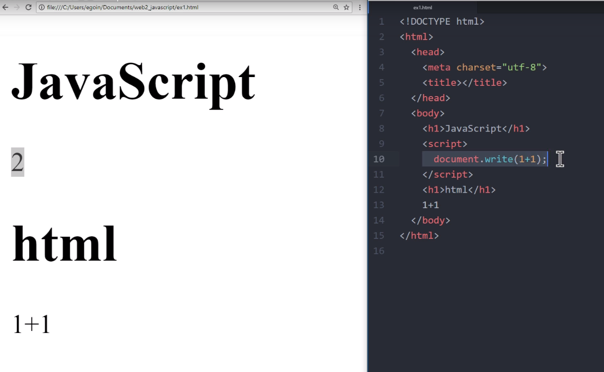

# JavaScript

## Html과 JavaScript의 만

### script 태

웹 브라우저에게 JavaScript로 해석되기를 바란다면 &lt;script&gt;&lt;/script&gt; 태그를 사용하면 된다. 

위 사진은 html과 js의 차이점을 보여준다. html에서 '1+1'은 텍스트 그대로 나타나지만, script 태그 안의 '1+1'은 계산되어 나타난다. 

### 이벤

