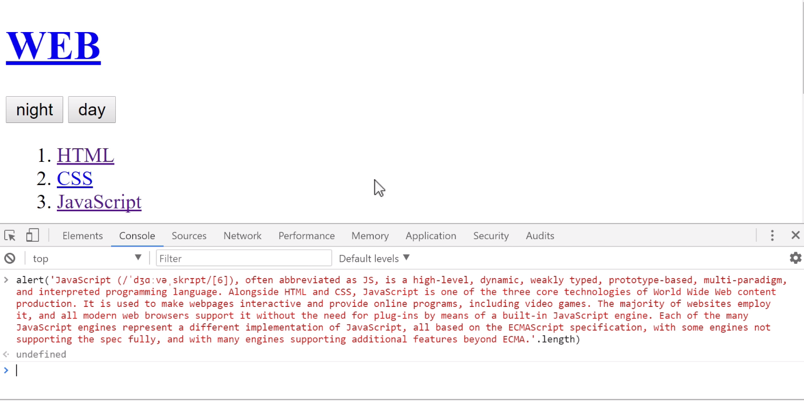
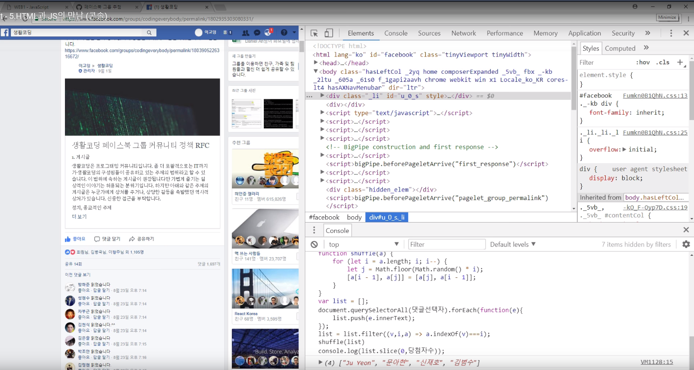

# JavaScript

## Html과 JavaScript의 만남

### script 태그

웹 브라우저에게 JavaScript로 해석되기를 바란다면 **&lt;script&gt;&lt;/script&gt;** 태그를 사용하면 된다. 


위 사진은 html과 js의 차이점을 보여준다. html에서 '1+1'은 텍스트 그대로 나타나지만, script 태그 안의 '1+1'은 계산되어 나타난다. 

### 이벤트

웹브라우저 위에서 일어나는 사건들 중, 사용자들에게 유용할만한, 사용자와 상호작용하는 것을 '이벤트' 라고 부른다. 'on'으로 시작하며 'onclick, onchange, onkeydown' 등 다양한 종류가 존재한다. 

```markup
<body>
  <input type="text" onchange="alert('changed')">
  <input type="text" onkeydown="alert('key down!')">
</body>
```

### 콘솔

콘솔을 이용하면 _파일을 만들지 않고도 javascript를 즉석에서 실행_할 수 있다. 아래의 사진이 바로 그 예이다. 당장 웹페이지 속 특정 단락의 글자 수가 궁금할 때, 굳이 파일을 만들지 않고도 콘솔 창에 alert\('텍스트~'.length\) 만 입력하면 글자 수를 알림창으로 띄워준다. 



좀 더 현실적인 예제도 있다. 페이스북에서 댓글 이벤트를 한다고 하자. 당장 달린 댓글에서 공정하게 4사람을 뽑아야 하는데, 굳이 파일을 만들지 않고도 가능한 일이다. 콘솔 창에 랜덤하게 element를 추출해주는 코드를 복붙한 후, 뽑을 element의 개수만 조정해주면, 아래 사진처럼 4명을 뽑아준다. 



## 데이터 타입, 


